# C++篇

## 1.语法

### new/delete与malloc/free的区别

​	1.new/delete会调用构造/析构函数，malloc/free则不会

​	2.new/delete无需显式给出分配的内存大小，malloc/free则需要显式给出

​	3.new/delete是操作符，可以重载，malloc/free是库函数，无法重载。

​	4.malloc返回类型为void*,必须强制类型转换对应类型指针，new则直接返回对应类型指针

|        特征        |              new/delete               |             malloc/free              |
| :----------------: | :-----------------------------------: | :----------------------------------: |
|   分配内存的位置   |              自由存储区               |                  堆                  |
| 内存分配失败返回值 |             完整类型指针              |                void*                 |
| 内存分配失败返回值 |             默认抛出异常              |               返回NULL               |
|   分配内存的大小   |       由编译器根据类型计算得出        |          必须显式指定字节数          |
|      处理数组      |       有处理数组的new版本new[]        | 需要用户计算数组的大小后进行内存分配 |
|  已分配内存的扩充  |            无法直观地处理             |         使用realloc简单完成          |
|    是否相互调用    | 可以，看具体的operator new/delete实现 |             不可调用new              |
| 分配内存时内存不足 | 客户能够指定处理函数或重新制定分配器  |       无法通过用户代码进行处理       |
|      函数重载      |                 允许                  |                不允许                |
| 构造函数与析构函数 |                 调用                  |                不调用                |

### 指针与引用的区别

★相同点：

●都是地址的概念；

指针指向一块内存，它的内容是所指内存的地址；而引用则是某块内存的别名。

★不同点：

1. 引用必须被初始化，但是不分配存储空间。指针不声明时初始化，在初始化的时候需要分配存储空间。
2. 引用初始化后不能被改变，指针可以改变所指的对象。
3. **不存在指向空值的引用，但是存在指向空值的指针**。

●指针是一个实体，而引用仅是个别名；

●引用只能在定义时被初始化一次，之后不可变；指针可变；引用“从一而终”，指针可以“见异思迁”；

**●引用不能为空，指针可以为空**；

●“**sizeof 引用**”得到的是所指向的变量(对象)的大小，而“**sizeof 指针**”得到的是指针本身的大小；

●指针和引用的自增(++)运算意义不一样；

●引用是类型安全的，而指针不是 (引用比指针多了类型检查）

### **时间/空间复杂度**

时间复杂度：

> 反映当数据量变化时，操作次数的多少;时间复杂度在评估时，要只保留最高项，并且不要最高项的系数。

空间复杂度：

> 是指算法在计算机内执行时，所需额外开辟的空间。

常数项：

> 与N的大小无关的操作。

### public,protected,private访问规则

第一：**private, public, protected访问标号的访问范围。**

private：只能由1.该类中的函数、2.其友元函数访问。

不能被任何其他访问，该类的对象也不能访问。

protected：可以被1.该类中的函数、2.子类的函数、以及3.其友元函数访问。

但不能被该类的对象访问。

public：可以被1.该类中的函数、2.子类的函数、3.其友元函数访问，也可以由4.该类的对象访问。

 

注：友元函数包括3种：设为友元的普通的非成员函数；设为友元的其他类的成员函数；设为友元类中的所有成员函数。

第二：**类的继承后方法属性变化。**

private属性不能够被继承。

使用private继承，父类的protected和public属性在子类中变为private；
使用protected继承，父类的protected和public属性在子类中变为protected；
使用public继承，父类中的protected和public属性不发生改变;

如下所示：

|               | public    | protected | private |
| ------------- | --------- | --------- | ------- |
| public继承    | public    | protected | 不可用  |
| protected继承 | protected | protected | 不可用  |
| private继承   | private   | private   | 不可用  |

protected继承和private继承能降低访问权限。

### 浅拷贝和深拷贝的区别？

#### 拷贝对象不包含引用

 -如果拷贝的对象里的元素只有值，没有引用，那浅拷贝和深拷贝没有差别

都会将原有对象复制一份，产生一个新对象，对新对象里的值进行修改不会影响原有对象，新对象和原对象完全分离开。

#### 拷贝对象包含引用

 -如果拷贝的对象里的元素包含引用，那浅拷贝和深拷贝是不同的。

浅拷贝虽然将原有对象复制一份，但是依然保存的是引用，所以对新对象里的引用里的值进行修改，依然会改变原对象里的列表的值，新对象和原对象完全分离开并没有完全分离开。

而深拷贝则不同，它会将原对象里的引用也新创建一个，即新建一个列表，然后放的是新列表的引用，这样就可以将新对象和原对象完全分离开。

### C++空类中有哪些默认的函数？

1.构造函数

2.拷贝构造函数

3.析构函数

4.赋值操作符重载函数

5.取地址操作符重载函数

6.const修饰的取地址操作符重载函数

### i++是原子操作么？

[int i =1 是原子操作吗？i++是原子操作吗？_JMW1407的博客-CSDN博客](https://blog.csdn.net/JMW1407/article/details/108318960)

**i=1是原子操作；**（cpu将立即数1搬运到变量a的内存地址）

**i++、++i、a=b都不是原子操作；**

i++分为三个阶段：在cpu执行时

- 第一步，先将 count所在内存的值加载到寄存器；
- 第二步，将寄存器的值自增1；
- 第三步，将寄存器中的值写回内存。

a=b时是先将b的值放入寄存器，再从寄存器写会a，都可以中断。

### 左值右值

[C++：浅谈右值引用_Dr. Lin的博客-CSDN博客_右值引用](https://blog.csdn.net/tonglin12138/article/details/91479048?ops_request_misc=&request_id=&biz_id=102&utm_term=右值引用 c++&utm_medium=distribute.pc_search_result.none-task-blog-2~all~sobaiduweb~default-0-91479048.first_rank_v2_pc_rank_v29&spm=1018.2226.3001.4187)

**左值相当于地址值，右值相当于数据值**。右值指的是引用了一个存储在某个内存地址里的数据。

​		L-value中的L指的是Location，表示可寻址。
​		R-value中的R指的是Read，表示可读。

变量是左值。

const变量、字面值常量、表达式、函数返回值是右值。


左值一定在内存中，右值有可能在内存中也有可能在寄存器中

```c++
int a=5;

int b=a;//此时a在内存中

int b=a+1;//此时a+1在寄存器中

int *p=&a;//此时&a在寄存器中
```


左值引用就是对一个左值进行引用的类型。右值引用就是对一个右值进行引用的类型。右值引用和左值引用都是属于引用类型。无论是声明一个左值引用还是右值引用，都必须立即进行初始化。（引用是一个别名）

**为什么要右值引用**？

右值引用在你需要使用寄存器中的值的时候可以进行右值引用。寄存器的刷新速度很快，没有右值引用的话就需要将寄存器中的值拷贝到内存中，在进行使用，这是很浪费时间的。


## 关键字

### static

#### c++static关键字的作用

c/c++共有

1）：修饰全局变量时，表明一个全局变量只对定义在同一文件中的函数可见。   

2）：修饰局部变量时，表明该变量的值不会因为函数终止而丢失。              

3）：修饰函数时，表明该函数只在同一文件中调用。                      

c++独有：

 4）：修饰类的数据成员，表明对该类所有对象这个数据成员都只有一个实例。即该实例归 所有对象共有。

 5）：用static修饰不访问非静态数据成员的类成员函数。这意味着一个静态成员函数只能访问它的参数、类的静态数据成员和全局变量

#### **static的优势：**

​        可以节省内存，因为它是所有对象所公有的，因此，对多个对象来说，静态数据成员只存储一处，供所有对象共用。静态数据成员的值对每个对象都是一样，但它的值是可以更新的。只要对静态数据成员的值更新一次，保证所有对象存取更新后的相同的值，这样可以提高时间效率。


### const

#### **1、定义常量**

(1)const修饰变量，变量value是不可变的。

#### **2、指针使用CONST**

(1)指针本身是常量不可变
char* const pContent;

(2)指针所指向的内容是常量不可变
const char *pContent;

(3)两者都不可变
const char* const pContent;

#### **3、函数中使用CONST**

(1)const修饰函数参数
a.传递过来的参数在函数内不可以改变(无意义，因为Var本身就是形参)

void function(const int Var);

b.参数指针所指内容为常量不可变

void function(const char* Var);

c.参数指针本身为常量不可变(也无意义，因为char* Var也是形参)

void function(char* const Var);

d.参数为引用，为了增加效率同时防止修改。修饰引用参数时：

void function(const Class& Var); //引用参数在函数内不可以改变

void function(const TYPE& Var); //引用参数在函数内为常量不可变

(2)const 修饰函数返回值
const修饰函数返回值其实用的并不是很多，它的含义和const修饰普通变量以及指针的含义基本相同。

#### **4、类相关CONST**

(1)const修饰成员变量
const修饰类的成员函数，表示成员常量，不能被修改，同时它只能在初始化列表中赋值。

(2)const修饰成员函数

a. const成员函数不被允许修改它所在对象的任何一个数据成员。

b. const成员函数能够访问对象的const成员，而其他成员函数不可以。

(3)const修饰类对象/对象指针/对象引用

· const修饰类对象表示该对象为常量对象，其中的任何成员都不能被修改。对于对象指针和对象引用也是一样。

· const修饰的对象，该对象的任何非const成员函数都不能被调用，因为任何非const成员函数会有修改成员变量的企图。


#### const与#define的区别

（1）就起作用的阶段而言： #define是在编译的预处理阶段起作用，而const是在 编译、运行的时候起作用。
（2）就起作用的方式而言： #define只是简单的字符串替换，没有类型检查。而const有对应的数据类型，是要进行判断的，可以避免一些低级的错误。 
（3）就存储方式而言：#define只是进行展开，有多少地方使用，就替换多少次，它定义的宏常量在内存中有若干个备份；const定义的只读变量在程序运行过程中只有一份备份。
（4）从代码调试的方便程度而言： const常量可以进行调试的，define是不能进行调试的，因为在预编译阶段就已经替换掉了。

### volatile

指定当前变量必须从内存读取而不能从寄存器读取。

### extern


## 内存管理

c++内存分为代码区，常量区，全局静态区，堆区，栈区

| 代码区     | 常量区                      | 数据段（全局静态区） | 堆区                     | 栈区                                                         |
| :--------- | :-------------------------- | :------------------- | :----------------------- | :----------------------------------------------------------- |
| 程序的代码 | 字符串， 全局常量，静态常量 | 全局变量，静态变量   | 供程序申请（new/malloc） | 函数调用时的实参；函数的返回地址；auto变量及auto常量；局部变量 |
| 大小固定   | 大小固定                    | 大小固定             | 动态/自由分配            | 通常固定1M/2M                                                |


### 堆（heap）

由new和malloc进行动态内存分配。

### 栈（stack）

存放局部变量，函数参数，函数返回值等

#### 堆和栈的区别

主要的区别由以下几点：

  1、管理方式不同；（编译器自动管理；程序员控制）

  2、空间大小不同；（1M；4G）

  3、能否产生碎片不同；（不会；会）

  4、生长方向不同；（自上而下；自下而上）

  5、分配方式不同；

  6、分配效率不同；

## 面向对象

三个基本特征：封装、继承、多态。

### 封装


### 继承

　基类与派生类的关系
　　任何一个类都可以派生出一个新类，派生类也可以再派生出新类，因此，基类和派生类是相对而言的。
　　基类与派生类之间的关系可以有如下几种描述：

  　　1. 派生类是基类的具体化
       类的层次通常反映了客观世界中某种真实的模型。在这种情况下，不难看出：基类是对若干个派生类的抽象，而派生类是基类的具体化。基类抽取了它的派生类的公共特征，而派生类通过增加行为将抽象类变为某种有用的类型。
       
   2. 派生类是基类定义的延续

      先定义一个抽象基类，该基类中有些操作并未实现。然后定义非抽象的派生类，实现抽象基类中定义的操作。例如，虚函数就属此类情况。这时，派生类是抽象的基类的实现，即可看成是基类定义的延续。这也是派生类的一种常用方法。

   3. 派生类是基类的组合

      在多继承时，一个派生类有多于一个的基类，这时派生类将是所有基类行为的组合

      派生类将其本身与基类区别开来的方法是添加数据成员和成员函数。因此，继承的机制将使得在创建新类时，只需说明新类与已有类的区别，从而大量原有的程序代码都可以复用，所以有人称类是“可复用的软件构件”。

  

### 多态

多态就是同一事物在不同场景下的不同形态。

关于多态，简而言之就是用父类型别的指针指向其子类的实例，然后通过父类的指针调用实际子类的成员函数。

多态分为静态多态、动态多态。静态多态又包括函数重载和泛型编程。动态多态即虚函数。

#### 静态多态

静态多态又包括函数重载和泛型编程。

静态多态是编译器**在编译期间完成**的，编译器会根据实参类型来选择调用合适的函数，如果有合适的函数可以调用就调，没有的话就会发出警告或者报错。（编译时决议）

#### 动态多态：

动态多态即虚函数。

我们把经过虚表调用虚函数的过程称为动态绑定，其表现出来的现象称为运行时多态。动态绑定区别于传统的函数调用，传统的函数调用我们称之为静态绑定，即函数的调用在编译阶段就可以确定下来了。

显然这和静态多态是一组反义词，它是在**程序运行时**根据基类的引用（指针）指向的对象来确定自己具体该调用哪一个类的虚函数。（运行时决议）

动态多态的条件： 
●**基类中必须包含虚函数，并且派生类中一定要对基类中的虚函数进行重写。** 
●**通过基类对象的指针或者引用调用虚函数。**

重写 ： 
（a）基类中将被重写的函数必须为虚函数 （其派生类中与其同名同参的函数不需要加virtual也是虚函数）
（b）基类和派生类中虚函数的原型必须保持一致（返回值类型，函数名称以及参数列表），协变和析构函数（基类和派生类的析构函数是不一样的）除外 
（c）访问限定符可以不同 
那么问题又来了，什么是协变？ 
协变：基类（或者派生类）的虚函数返回基类（派生类）的指针（引用） 


#### 多态缺陷

●降低了程序运行效率（多态需要去找虚表的地址） 
●空间浪费

#### 重载与重写的区别

**重载overload：**在同一个类中，函数名相同，参数列表不同（函数的参数个数、参数类型或参数顺序三者中必须至少有一种不同），函数返回值的类型可以相同，也可以不相同。发生在一个类内部，不能跨作用域。

编译器会根据这些函数的不同参数列表，将同名的函数名称做修饰，从而生成一些不同名称的预处理函数

 

**重写override：**也叫覆盖，子类重新定义父类中有相同名称相同参数的虚函数，主要是在继承关系中出现的，被重写的函数必须是virtual的，重写函数的访问修饰符可以不同，尽管virtual是private的，子类中重写函数改为public,protected也可以，体现了多态。

 

**重定义redefining：**也叫隐藏，子类重新定义父类中有相同名称的非虚函数，参数列表可以相同可以不同，会覆盖其父类的方法，可以理解成发生在继承中的重载。//是否体现了多态？

a如果派生类的函数和基类的函数同名，但是参数不同，此时，不管有无virtual，基类的函数被隐藏。

b如果派生类的函数与基类的函数同名，并且参数也相同，但是基类函数没有vitual关键字，此时，基类的函数被隐藏。（如果有virtual就成重写了）
**区别**

|      | 重载               | 重写         |
| ---- | ------------------ | ------------ |
|      | 静态多态           | 动态多态     |
|      | 编译时             | 运行时       |
|      | 一个类中           | 子类与父类间 |
|      | 不同参数列表       | 相同参数列表 |
|      | 不能只有返回值不同 | 返回值相同   |

重载实现的是编译时的多态性，重写实现的是运行时的多态性。重载发生在一个类中，同名的方法如果有不同的参数列表则视为重载；重写发生在子类与父类之间，重写要求子类被重写方法与父类被重写方法有相同的参数列表，有兼容的返回类型。

#### 虚函数

C++中的虚函数的作用主要是实现了多态的机制。基类定义虚函数，子类可以重写该函数；在派生类中对基类定义的虚函数进行重写时，需要在派生类中声明该方法为虚方法。

一个类函数的调用并不是在编译时刻被确定的，而是在运行时刻被确定的。由于编写代码的时候并不能确定被调用的是基类的函数还是哪个派生类的函数，所以被成为“虚”函数。

虚函数只能借助于指针或者引用来达到多态的效果。

当子类重新定义了父类的虚函数后，**当父类的指针指向子类对象的地址时**，父类指针根据赋给它的不同子类指针，动态的调用子类的该函数，而不是父类的函数

且这样的函数调用发生在运行阶段，而不是发生在编译阶段，称为动态联编。而函数的重载可以认为是多态，只不过是静态的。注意，非虚函数静态联编，效率要比虚函数高，但是不具备动态联编能力。

//如果使用了**virtual**关键字，程序将根据引用或指针指向的 **对 象 类 型** 来选择方法，否则使用**引用类型或指针类型**来选择方法。

##### 虚函数的底层实现机制 

**实现原理：虚函数表+虚表指针**

[C++ 虚函数表 vfptr_好记性不如烂笔头-CSDN博客](https://blog.csdn.net/yc461515457/article/details/52658589?ops_request_misc=%7B%22request%5Fid%22%3A%22161918781116780269813183%22%2C%22scm%22%3A%2220140713.130102334..%22%7D&request_id=161918781116780269813183&biz_id=0&utm_medium=distribute.pc_search_result.none-task-blog-2~all~sobaiduend~default-3-52658589.first_rank_v2_pc_rank_v29&utm_term=虚函数表&spm=1018.2226.3001.4187)

同一个类的不同实例共用同一份虚函数表, 她们都通过一个所谓的虚函数表指针__vfptr(定义为void**类型)指向该虚函数表.

编译器处理虚函数的方法是：
给每个对象添加一个指针，存放了指向虚函数表的地址，虚函数表存储了为类对象进行声明的虚函数地址。比如基类对象包含一个指针，该指针指向基类所有虚函数的地址表，派生类对象将包含一个指向独立地址表的指针，如果派生类提供了虚函数的新定义，该虚函数表将保存新函数的地址，如果派生类没有重新定义虚函数，该虚函数表将保存函数原始版本的地址。如果派生类定义了新的虚函数，则该函数的地址将被添加到虚函数表中，注意虚函数无论多少个都只需要在对象中添加一个虚函数表的地址。

调用虚函数时，程序将查看存储在对象中的虚函数表地址，转向相应的虚函数表，使用类声明中定义的第几个虚函数，程序就使用数组的第几个函数地址，并执行该函数。

**使用虚函数后的变化：**
（1）	对象将增加一个存储地址的空间（32位系统为4字节，64位为8字节）。
（2）	每个类编译器都创建一个虚函数地址表
（3）	对每个函数调用都需要增加在表中查找地址的操作。

**虚函数的注意事项：**

总结前面的内容
（1） 基类方法中声明了方法为虚后，该方法在基类派生类中是虚的。
（2） 若使用指向对象的引用或指针调用虚方法，程序将根据对象类型来调用方法，而不是指针的类型。
（3）如果定义的类被用作基类，则应将那些要在派生类中重新定义的类方法声明为虚。

##### 析构函数可以使用虚函数么？

**基类的析构函数应该为虚函数。**（在实现多态时，当用基类操作派生类，在析构时防止只析构基类而不析构派生类的状况发生，以免造成内存泄露）

如果派生类没有重定义函数，则会使用基类版本。
重新定义继承的方法若和基类的方法不同（协变除外），会将基类方法隐藏；如果基类声明方法被重载，则派生类也需要对重载的方法重新定义，否则调用的还是基类的方法。

 如果没有继承或不需要基类对派生类及对象进行操作,则不能定义虚函数,因为这样会增加内存开销（因为添加了虚函数表存虚函数指针）

##### **那些函数不能定义为虚函数？** 

1）友元函数，它不是类的成员函数 
2）全局函数 
3）静态成员函数，它没有this指针 
3）构造函数，拷贝构造函数，以及赋值运算符重载（可以但是一般不建议作为虚函数）

##### 如何让构造函数的初始化不同呢？

1.new一个类，再调用init函数，在init函数里实现不同的初始化；

2.重载构造函数；

##### 纯虚函数

**纯虚函数**是在基类中声明的虚函数，它在基类中没有定义，但要求任何派生类都要定义自己的实现方法。在基类中实现纯虚函数的方法是在函数原型后加“=0”
　virtual void funtion1()=0
**原因：**为了方便使用多态特性，我们常常需要在基类中定义虚拟函数。在很多情况下，基类本身生成对象是不合情理的。

在成员函数(必须为虚函数)的形参列表后面写上=0，则成员函数为**纯虚函数**。

**包含纯虚函数的类叫做抽象类**（也叫接口类），抽象类不能实例化出对象。纯虚函数在派生类中重新定义以后，派生类才能实例化出对象。纯虚函数是一定要被继承的，否则它存在没有任何意义。

定义一个函数为虚函数，不代表函数为不被实现的函数。

定义他为虚函数是为了允许用基类的指针来调用子类的这个函数。

定义一个函数为纯虚函数，才代表函数没有被实现。

定义纯虚函数是为了实现一个接口，起到一个规范的作用，规范继承这个类的程序员必须实现这个函数。

### 类和对象

 struct和class唯一的**区别**就在于 **默认的访问权限不同**

- struct 默认权限为公共
- class 默认权限为私有

#### 父类子类强制转换

base父类有个虚函数virtual drive();子类重写了这个虚函数，子类new了一个数组，把这个数组指针强制类型转换为父类指针 可行么（会发生什么）？用这个父类指针调用父类的drive虚函数 可行么？

**父类不能强转为子类；子类可以强转为父类；**

**子类强转后调用父类的虚函数会执行子类的重写；调用父类的非虚函数会执行父类的非虚函数。**

## C++11

### 智能指针

为了更容易(同时也更安全)地使用动态内存，C++11标准库提供了两种智能指针(smart pointer)类型来管理动态对象。智能指针的行为类似常规指针，**重要的区别是它负责自动释放所指的对象**。C++11标准库提供的这两种智能指针的区别在于管理底层指针的方式：shared_ptr允许多个指针指向同一个对象；unique_ptr则"独占"所指向的对象。C++11标准库还定义了一个名为weak_ptr的辅助类，它是一种弱引用，指向shared_ptr所管理的对象。这三种类型都定义在**memory头文件**中。智能指针是模板类而不是指针。

**C++开发处理内存泄漏最有效的办法就是使用智能指针**，使用智能指针就不会担心内存泄露的问题了，**因为智能指针可以自动删除分配的内存。**

智能指针是指向动态分配(堆)对象指针，用于生存期控制，能够确保自动正确的销毁动态分配的对象，防止内存泄露。**它的一种通用实现技术是使用引用计数。每次使用它，内部的引用计数加1，每次析构一次，内部引用计数减1，减为0时，删除所指向的堆内存。**


#### shared_ptr

shared_ptr基于”引用计数”模型实现，多个shared_ptr可指向同一个动态对象，并维护一个共享的引用计数器，记录了引用同一对象的shared_ptr实例的数量。当最后一个指向动态对象的shared_ptr销毁时，会自动销毁其所指对象(通过delete操作符)。

缺点：循环引用会导致内存泄漏，解决方式为weak_ptr;

#### weak_ptr

weak_ptr被设计为与shared_ptr共同工作，可以从一个shared_ptr或者另一个weak_ptr对象构造，获得资源的观测权。但weak_ptr没有共享资源，它的构造不会引起指针引用计数的增加。同样，在weak_ptr析构时也不会导致引用计数的减少，它只是一个静静地观察者。weak_ptr没有重载operator*和->，这是特意的，因为它不共享指针，不能操作资源，这是它弱的原因。但它可以使用一个非常重要的成员函数lock()从被观测的shared_ptr获得一个可用的shared_ptr对象，从而操作资源。

#### unique_ptr

unique_ptr 是 C++ 11 提供的用于防止内存泄漏的智能指针中的一种实现，独享被管理对象指针所有权的智能指针。unique_ptr对象包装一个原始指针，并负责其生命周期。当该对象被销毁时，会在其析构函数中删除关联的原始指针。
unique_ptr具有->和*运算符重载符，因此它可以像普通指针一样使用。


**C++11中的右值引用、转移语义和完美转发**

## STL

### vector

#### vector中的resize，reserve的区别

1. reserve()只修改capacity大小，不修改size大小，
2. resize()既修改capacity大小，也修改size大小。

#### vector和list的区别

|          | vector                | list                   |
| -------- | --------------------- | ---------------------- |
| 结构     | 数组                  | 双向循环链表           |
| 内存空间 | 内存连续,起始地址不变 | 内存不连续             |
| 随机存取 | O(1)                  | O(n)                   |
| 插入删除 | O(n)                  | O(1)                   |
| 迭代器   | 原生态指针            | 对原生态指针进行了封装 |

vector和list对于迭代器的支持不同：
		相同点在于，vector< int >::iterator和list< int >::iterator都重载了 “++ ”操作。
		而不同点在于，在vector中，iterator支持 ”+“、”+=“，”<"等操作。而list中则不支持。

迭代器失效
  vector在插入元素时的时候，要重新给所有的迭代器赋值，因为插入元素有可能导致扩容，只是原来的迭代器	失效，删除元素时当前迭代器同样需要重新赋值，否则会失效。
  list在插入元素的时候不会导致迭代器实现，删除元素的时候指挥导致当前迭代器失效，其他的迭代器不会受	到影响。

使用场景
  vector适合需要高效率存储，需要随机访问，并且不管行插入和删除效率的场景。
  list适合有大量的插入和删除操作，并且不关心随机访问的场景

### deque

#### deque是怎么实现的？

双端队列

在头和尾插入删除的时间复杂度为O（1）；支持随机存取；


### map


### unordered_map


## 模板


这里首先说下语言基础知识，一些关键字和实现原理等：

- 指针、引用、数组、内存
- C和 C++ 的一些区别，比如 new、delete 和 malloc、free 的区别
- C++中引用与指针区别
- 继承、虚继承、菱形继承等
- C++虚机制：虚函数、虚函数表、纯虚函数
- 多态： 动态绑定，静态多态
- C++里一些关键字的作用：static、const、volatile、extern
- C++ 重写、重载
- 智能指针使用：shared_ptr、weak_ptr、unique_ptr等
- 类型转换：static_cast, dynamic_cast, const_cast, reinterpret_cast
- STL大部分容器的实现原理，如 vector、deque、map、hashmap
- 模板特化、偏特化，萃取 traits 技巧
- 程序编译链接机制、内存布局（memory layout）、对象模型
- C++11 部分新特性，比如右值引用、完美转发等
- 智能指针原理：引用计数、RAII（资源获取即初始化）思想
- C++构造、析构、移动、拷贝等
- C++ 内存管理，堆、栈、指针、野指针、内存泄露等
- 内联函数、宏定义区别等


# 操作系统篇

## 操作系统的组成

1.什么是操作系统？ 

(1)计算机硬件与用户软件之间的中间件程序集合

 (2)OS是一个资源管理程序

 (3)OS是一个控制调度程序

 (4)OS一般有一个内核（kernel)程序，开机后一直运行

 (5)提供用户和计算机之间的接口

2.现代操作系统的五大组成部分：**进程管理、存储管理、文件管理、设备管理、系统调用**

3.操作系统的四个基本特征：**并发性，共享性，虚拟性，不确定性 （异步性）**

4.分时操作系统的基本特征：交互性、多用户同时性、独立性，及时性

## 进程线程

### 进程线程的区别

进程是操作系统分配资源的基本单位，线程是CPU调度的基本单位

进程的资源是独享的，线程是共享的进程的资源。

进程崩了不影响别的进程，线程崩了会导致同进程的线程的都崩掉

进程创建，切换，终止的开销大，线程小

进程之间的通信更复杂，线程通信相对容易


数据需要隔离时选进程，数据需要共享时选线程。

多进程适用于CPU密集型，多线程适用于I//O密集型（切换开销小）

### 进程间通信方式

**管道通信，共享内存，消息队列，信号量，信号，套接字socket；**

#### 共享内存（Shared Memory）

它使得多个进程可以访问同一块内存空间，不同进程可以及时看到对方进程中对共享内存中数据得更新。这种方式需要依靠某种同步操作，如互斥锁和信号量等

特点：

1)共享内存是最快的一种IPC，因为进程是直接对内存进行存取

2)因为多个进程可以同时操作，所以需要进行同步

3)信号量+共享内存通常结合在一起使用，信号量用来同步对共享内存的访问

**共享内存的实现方式？**

**同一块物理内存被映射到进程A、B各自的进程地址空间。**进程A可以即时看到进程B对共享内存中数据的更新，反之亦然。由于多个进程共享同一块内存区域，必然需要某种同步机制，互斥锁和信号量都可以。

**为什么共享内存最快？**

因为进程可以直接读写内存，而不需要任何数据的拷贝。对于像管道和消息队列等通信方式，则需要在内核和用户空间进行四次的数据拷贝，而共享内存则只拷贝两次数据[1]：一次从输入文件到共享内存区，另一次从共享内存区到输出文件。

消息队列和管道基本上都是4次拷贝，而共享内存（mmap, shmget）只有两次。
4次：1，由用户空间的buf中将数据拷贝到内核中。2，内核将数据拷贝到内存中。3，内存到内核。4，内核到用户空间的buf.
2次： 1，用户空间到内存。 2，内存到用户空间。

#### socket

涉及的函数有：Bind() ，Listen()，accept ()，send()，receive()，connect()，close();

### 线程间通信方式

#### **锁机制**：

包括互斥锁、条件变量、读写锁

##### 互斥锁：

提供了以排他方式防止数据结构被并发修改的方法。

##### 读写锁：

允许多个线程同时共享数据，而对写操作是互斥的。

##### 条件变量：

可以以原子的方式阻塞进程，直到某个特定条件为真为止。对条件的测试是在互斥锁的保护下进行的。条件变量始终与互斥锁一起使用。

条件变量是利用线程间共享的全局变量进行同步的一种机制，主要包括两个动作：

​					一个线程因等待"条件变量的条件成立"而挂起；
​					另外一个线程使"条件成立"，给出信号，从而唤醒被等待的线程。
为了防止竞争，条件变量的使用总是和一个互斥锁结合在一起；通常情况下这个锁是std::mutex，并且管理这个锁 只能是 std::unique_lock<std::mutex> RAII模板类。

上面提到的两个步骤，分别是使用以下两个方法实现：

​			等待条件成立使用的是condition_variable类成员wait 、wait_for 或 wait_until。
​			给出信号使用的是condition_variable类成员notify_one或者notify_all函数。
在生产者消费者问题中，条件变量可以保证生产者不会在缓冲区满时加入数据，消费者也不会在缓冲区中空时消耗数据。

总结一下条件变量的几个关键点：

\1. wait()函数的内部实现是：先释放了互斥量的锁，然后阻塞以等待条件为真；
\2. notify系列函数需在unlock之后再被调用；
\3. 套路是：
    a. A线程拿住锁，然后wait,此时已经释放锁，只是阻塞了在等待条件为真；
    b. B线程拿住锁，做一些业务处理，然后令条件为真，释放锁，再调用notify函数；
    c. A线程被唤醒，接着运行。

#### **信号量机制（Semaphore）**：

包括无名进程信号量和命名线程信号量

#### **信号机制（Signal）**：

类似进程间的信号处理

#### 信号量与条件变量的区别？

（1）使用条件变量可以一次唤醒所有等待者，而这个信号量没有的功能，感觉是最大区别。

（2）信号量是有一个值（状态的），而条件变量是没有的，没有地方记录唤醒（发送信号）过多少次，也没有地方记录唤醒线程（wait返回）过多少次。从实现上来说一个信号量可以是用mutex + counter + condition variable（互斥锁+计数器+条件变量）实现的。因为信号量有一个状态，如果想精准的同步，那么信号量可能会有特殊的地方。信号量可以解决条件变量中存在的唤醒丢失问题。

（3）在Posix.1基本原理一文声称，有了互斥锁和条件变量还提供信号量的原因是：“本标准提供信号量的而主要目的是提供一种进程间同步的方式；这些进程可能共享也可能不共享内存区。互斥锁和条件变量是作为线程间的同步机制说明的；这些线程总是共享(某个)内存区。这两者都是已广泛使用了多年的同步方式。每组原语都特别适合于特定的问题”。尽管信号量的意图在于进程间同步，互斥锁和条件变量的意图在于线程间同步，但是信号量也可用于线程间，互斥锁和条件变量也可用于进程间。应当根据实际的情况进行决定。信号量最有用的场景是用以指明可用资源的数量。

### 协程

在有大量IO操作业务的情况下，我们采用协程替换线程，可以到达很好的效果，一是降低了系统内存，二是减少了系统切换开销，因此系统的性能也会提升。

在协程中尽量不要调用阻塞IO的方法，比如打印，读取文件，Socket接口等，除非改为异步调用的方式，并且协程只有在IO密集型的任务中才会发挥作用。

**协程只有和异步IO结合起来才能发挥出最大的威力。**


协程在io操作比较多，且IO是瓶颈的地方才有用。

首先协程算是用户态的线程，**优势主要是少了内核态用户态的切换和能自己来做调度**。
然后协程一般只在有IO操作的时候才能用到，对于一些会阻塞的IO操作，可以自己选择协程切换，等IO就绪了再切回来，可以更充分利用CPU。

## 内存缓存

## 缓冲溢出的影响

 缓冲区溢出是指当计算机向缓冲区填充数据时超出了缓冲区本身的容量，溢出的数据覆盖在合法数据上。

 危害有以下两点：

   1、程序崩溃，导致拒绝服务

   2、跳转并且执行一段恶意代码

   原因：造成缓冲区溢出的主要原因是程序中没有仔细检查用户输入。


## 死锁

在并发环境中，各进程因为资源竞争而造成的一种互相等待对方手里的资源，导致各进程都阻塞，都无法继续进行的现象。

### 死锁产生的条件：

1.互斥

2.不可剥夺

3.请求保持

4.循环等待

### 避免死锁的方式：

1.预防死锁：破坏死锁的必要条件

2.避免死锁：如银行家算法（分配资源前先判断一下分配后是否会造成系统处于不安全状态，不会则分配，会则拒绝）

3.死锁的检测和解除

检测：

死锁定理： 
           ①如果资源分配图中没有环路，则系统没有死锁； 
           ②如果资源分配图中出现了环路，则系统可能有死锁。 
或者说： 
当且仅当S状态的**资源分配图是不可完全简化**的时候，系统状态则是死锁状态

解除：

-资源剥夺法；

-撤销进程法

-进程回退法；

另外，系统处于不安全状态未必死锁，但死锁时一定处于不安全状态，系统处于安全状态一定不会死锁。

## 中断

### 中断分类

#### 外部中断

**1.可屏蔽中断**：**通过INTR线向CPU请求的中断**，主要来自外部设备如硬盘，打印机，网卡等。此类中断并不会影响系统运行，可随时处理，甚至不处理，所以名为可屏蔽中断。

**2.不可屏蔽中断**：**通过INTR线向CPU请求的中断**，主要来自外部设备如硬盘，打印机，网卡等。此类中断并不会影响系统运行，可随时处理，甚至不处理，所以名为可屏蔽中断。

#### 内部中断（软中断）

**1.陷阱**：**是一种有意的，预先安排的异常事件**，一般是在编写程序时故意设下的陷阱指令，而后执行到陷阱指令后，CPU将会调用特定程序进行相应的处理，**处理结束后返回到陷阱指令的下一条指令**。

如**系统调用**，程序调试功能等。

**2.故障**：**故障是在引起故障的指令被执行，但还没有执行结束时，CPU检测到的一类的意外事件。**出错时交由故障处理程序处理，**如果能处理修正这个错误，就将控制返回到引起故障的指令即CPU重新执这条指令。如果不能处理就报错。**

常见的故障如 **缺页**

**3.终止**：**执行指令的过程中发生了致命错误，不可修复，程序无法继续运行，只能终止，通常会是一些硬件的错误。**终止处理程序不会将控制返回给原程序，而是直接终止原程序。


## 文件管理

生产者消费者模型

共享内存是怎么实现的？（mmap?)

fork()之后两进程之间修改后结果 取地址后结果

1.什么是用户态内核态

2.进程线程的使用选择（场景）

3.线程锁的类型

4.锁锁的什么？

5.给我一个必死锁的场景，最简单的那种


- 并发经典的问题：读者写者、哲学家就餐问题
- 文件系统是如何组织的
- 互斥与同步（信号量、管程、锁）
- 死锁检测与避免
- 虚拟文件系统（VFS）是如何抽象的
- 线程的实现方式（一对一、多对一等）
- 为什么需要虚拟内存，MMU 具体如何做地址转换的
- 内存为什么分段、分页
- 页面置换算法
- 进程的状态、切换、调度

对于进程、线程这块你还可以把 fork、vfork、clone 、pthread_create 这些模块关系彻底搞清楚，对你理解 Linux 下的进程实现有非常大的帮助。


# 计算机网络篇

## TCP/IP

### 1.OSI七层模型与TCP/IP五层模型

| OSI七层模型 | TCP/IP五层模型 | 功能                                   | TCP/IP协议族                  |
| ----------- | -------------- | -------------------------------------- | ----------------------------- |
| 应用层      | 应用层         | 文件传输，电子邮件，文件服务，虚拟终端 | TFTP,HTTP,SMTP,FTP,DNS,Telnet |
| 表示层      |                | 数据格式化，代码转换，数据加密         | 没有协议                      |
| 会话层      |                | 解除或建立与别的结点的联系             | 没有协议                      |
| 传输层      | 传输层         | 提供端对端的接口                       | TCP,UDP                       |
| 网络层      | 网络层         | 为数据包选择路由                       | IP,ICMP,RIP,OSPF,BCP,ICMP     |
| 数据链路层  | 数据链路层     | 传输有地址的帧以及错误检测功能         | SLIP,CSLIP,PPP,ARP,RARP,MTU   |
| 物理层      | 物理层         | 以二进制数据形式在物理媒体上传输数据   | ISO2110,IEEE802,IEEE802.2     |

#### 帧和数据报分别位于TCP结构的哪一层？

数据帧在MAC层，数据包/IP数据报/报文分组在网络层，数据段（TCP）/数据报（UDP）在运输层，消息在应用层。

#### 为什么有MAC地址还要有IP地址？


###    2.TCP和UDP区别

| TCP              | UDP                                          |
| ---------------- | -------------------------------------------- |
| 面向连接的       | 无连接的                                     |
| 可靠的           | 不可靠的                                     |
| 支持点对点通信   | 支持一对一、一对多、多对一、多对多的通信模式 |
| 面向字节流       | 面向报文                                     |
| 有拥塞控制机制   | 没有拥塞控制，适合媒体通信                   |
| 首部开销20个字节 | 首部开销8个字节                              |


### 3.三次握手

所谓三次握手（Three-Way Handshake）即建立TCP连接，就是指建立一个TCP连接时，需要客户端和服务端总共发送3个包以确认连接的建立。在socket编程中，这一过程由客户端执行connect来触发，整个流程如下图所示：

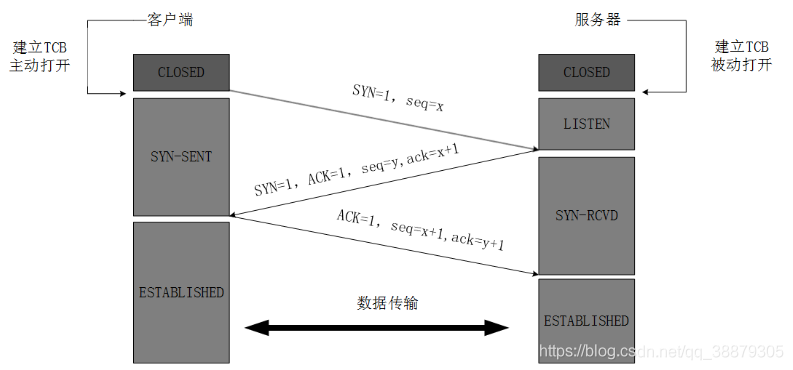

第一次握手：Client将标志位SYN置为1，随机产生一个值seq=J，并将该数据包发送给Server，Client进入SYN_SENT状态，等待Server确认。

第二次握手：Server收到数据包后由标志位SYN=1知道Client请求建立连接，Server将标志位SYN和ACK都置为1，ack=J+1，随机产生一个值seq=K，并将该数据包发送给Client以确认连接请求，Server进入SYN_RCVD状态。

第三次握手：Client收到确认后，检查ack是否为J+1，ACK是否为1，如果正确则将标志位ACK置为1，ack=K+1，并将该数据包发送给Server，Server检查ack是否为K+1，ACK是否为1，如果正确则连接建立成功，Client和Server进入ESTABLISHED状态，完成三次握手，随后Client与Server之间可以开始传输数据了。

**特点：** **SYN同步位**只有在TCP连接时才置1，连接成功后置0。

### 4.四次挥手

四次挥手（Four-Way Wavehand）即终止TCP连接，就是指断开一个TCP连接时，需要客户端和服务端总共发送4个包以确认连接的断开。在socket编程中，这一过程由客户端或服务端任一方执行close来触发，整个流程如下图所示：

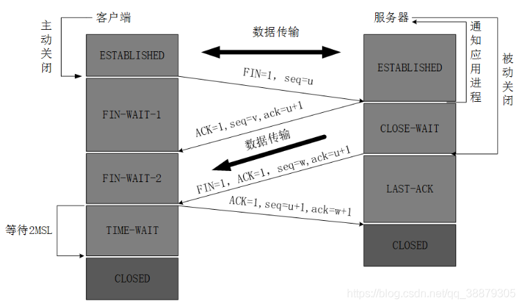

由于TCP连接时全双工的，因此，每个方向都必须要单独进行关闭，这一原则是当一方完成数据发送任务后，发送一个FIN来终止这一方向的连接，收到一个FIN只是意味着这一方向上没有数据流动了，即不会再收到数据了，但是在这个TCP连接上仍然能够发送数据，直到这一方向也发送了FIN。首先进行关闭的一方将执行主动关闭，而另一方则执行被动关闭，上图描述的即是如此。

第一次挥手：Client发送一个FIN，用来关闭Client到Server的数据传送，Client进入FIN_WAIT_1状态。

第二次挥手：Server收到FIN后，发送一个ACK给Client，确认序号为收到序号+1（与SYN相同，一个FIN占用一个序号），Server进入CLOSE_WAIT状态。

第三次挥手：Server发送一个FIN，用来关闭Server到Client的数据传送，Server进入LAST_ACK状态。

第四次挥手：Client收到FIN后，Client进入TIME_WAIT状态，接着发送一个ACK给Server，确认序号为收到序号+1，Server进入CLOSED状态，完成四次挥手。

#### 可靠传输和拥塞控制

TCP应用了所有RDT的技术，同时提供了：

- 发送窗口控制

  TCP有20字节的头部，其中就包括接收端对发送端的窗口限制（通常限制于接收端的缓存区大小）

- 重传时间限制

  包每被超时重传一次，等待时间就翻倍。

- 拥塞控制

  加性增，乘性减，慢启动。

  慢启动是指数增长到阈值，然后加性增，每收到一个确认窗口加1，遇到重传则乘性减，将阈值设为重传前窗口大小的一半。

  单位都是MSS，TCP报文段数据部分最大长度。

  超时重传直接从1开始慢启动；快速重传在早期Tahoe算法也是直接慢启动，在新版Reno算法则是减半不经历慢启动。

### TCP如何保证连接的可靠性？

TCP保证可靠性：

（1）序列号、确认应答、超时重传

数据到达接收方，接收方需要发出一个确认应答，表示已经收到该数据段，并且确认序号会说明了它下一次需要接收的数据序列号。如果发送发迟迟未收到确认应答，那么可能是发送的数据丢失，也可能是确认应答丢失，这时发送方在等待一定时间后会进行重传。这个时间一般是2*RTT(报文段往返时间）+一个偏差值。

（2）窗口控制与高速重发控制/快速重传（重复确认应答）

TCP会利用窗口控制来提高传输速度，意思是在一个窗口大小内，不用一定要等到应答才能发送下一段数据，窗口大小就是无需等待确认而可以继续发送数据的最大值。如果不使用窗口控制，每一个没收到确认应答的数据都要重发。

使用窗口控制，如果数据段1001-2000丢失，后面数据每次传输，确认应答都会不停地发送序号为1001的应答，表示我要接收1001开始的数据，发送端如果收到3次相同应答，就会立刻进行重发；但还有种情况有可能是数据都收到了，但是有的应答丢失了，这种情况不会进行重发，因为发送端知道，如果是数据段丢失，接收端不会放过它的，会疯狂向它提醒......

（3）拥塞控制

如果把窗口定的很大，发送端连续发送大量的数据，可能会造成网络的拥堵（大家都在用网，你在这狂发，吞吐量就那么大，当然会堵），甚至造成网络的瘫痪。所以TCP在为了防止这种情况而进行了拥塞控制。

慢启动：定义拥塞窗口，一开始将该窗口大小设为1，之后每次收到确认应答（经过一个rtt），将拥塞窗口大小*2。

拥塞避免：设置慢启动阈值，一般开始都设为65536。拥塞避免是指当拥塞窗口大小达到这个阈值，拥塞窗口的值不再指数上升，而是加法增加（每次确认应答/每个rtt，拥塞窗口大小+1），以此来避免拥塞。

将报文段的超时重传看做拥塞，则一旦发生超时重传，我们需要先将阈值设为当前窗口大小的一半，并且将窗口大小设为初值1，然后重新进入慢启动过程。

快速重传：在遇到3次重复确认应答（高速重发控制）时，代表收到了3个报文段，但是这之前的1个段丢失了，便对它进行立即重传。

然后，先将阈值设为当前窗口大小的一半，然后将拥塞窗口大小设为慢启动阈值+3的大小。

这样可以达到：在TCP通信时，网络吞吐量呈现逐渐的上升，并且随着拥堵来降低吞吐量，再进入慢慢上升的过程，网络不会轻易的发生瘫痪。

#### 滑动窗口和拥塞控制是两种不同的方法么？是两种窗口么？

窗口分为滑动窗口和拥塞窗口。

滑动窗口是接受数据端使用的窗口大小，用来告知发送端接收端的缓存大小，以此可以控制发送端发送数据的大小，从而达到流量控制的目的。

那么对于数据的发送端就是拥塞窗口了，拥塞窗口不代表缓存，拥塞窗口指某一源端数据流在一个RTT内可以最多发送的数据包数

#### 滑动窗口

滑动窗口协议是传输层进行流控的一种措施，接收方通过通告发送方自己的可以接受缓冲区大小（这个字段越大说明网络吞吐量越高），从而控制发送方的发送速度，不过如果接收端的缓冲区一旦面临数据溢出，窗口大小值也会随之被设置一个更小的值通知给发送端，从而控制数据发送量（发送端会根据接收端指示，进行流量控制）。

#### 拥塞控制

拥塞控制：防止过多的数据注入到网络中，这样可以使网络中的路由器或链路不致过载。拥塞控制所要做的都有一个前提：网络能够承受现有的网络负荷。拥塞控制是一个全局性的过程，涉及到所有的主机、路由器，以及与降低网络传输性能有关的所有因素。

    流量控制：指点对点通信量的控制，是端到端正的问题。流量控制所要做的就是抑制发送端发送数据的速率，以便使接收端来得及接收。
    
    拥塞控制代价：需要获得网络内部流量分布的信息。在实施拥塞控制之前，还需要在结点之间交换信息和各种命令，以便选择控制的策略和实施控制。这样就产生了额外的开销。拥塞控制还需要将一些资源分配给各个用户单独使用，使得网络资源不能更好地实现共享。


然后把拥塞窗口cwnd重新设置为1，执行慢开始算法。这样做的目的就是**要迅速减少主机发送到网络中的分组数，使得发生 拥塞的路由器有足够时间把队列中积压的分组处理完毕**。

强调：“拥塞避免”并非指完全能够避免了拥塞。利用以上的措施要完全避免网络拥塞还是不可能的。“拥塞避免”是说在拥塞避免阶段将拥塞窗口控制为按线性规律增长，**使网络比较不容易出现拥塞。**

#### 两者简单比较：

相同：提高网络性能。 
不同： 
  [1].流量控制：在TCP连接上实现对发送流量的控制，考虑点对点之间对通信量的控制，端到端，即：控制发送端的数据发送速率，使接收端可以来得及接收，保证网络高效稳定运行。 
  [2].拥塞控制：处理网络拥塞现象，考虑网络能够承受现有的网络负荷，全局性变量，涉及所有的路由器、主机以及与降低网络传输性能有关的因素。防止过多的数据注入到网络，使网络中的路由器或链路不致过载，确保通信子网可以有效为主机传递分组。


1.滑动窗口解决的是发送方和接收方接收数据速率不一致的问题,通过设置滑动窗口(可以通俗的理解为接收方的缓存)可以缓解这一个问题。具体的操作是接收方会向发送方通知自己可以接受数据的大小，而发送方会根据这个数值，发送数据。
2.拥塞窗口用控制全局网络的拥塞情况。通过控制发送方每次发送的流量的多少，用来逐渐试探整体网络的拥塞程度。如果没有拥塞控制，发送方每次发送的数据大小为滑动窗口，在只有2台主机的时候确实是没有问题的，但是如果放到现实的网络大环境中来说是行不通的。因为如果每台主机都发送的窗口大小的数据，那么整个网络系统必然会瘫痪。所以通过在发送方设置拥塞窗口，可以有效缓解网络压力。


1. TCP连接的特点，如何保证连接的安全可靠？

   TCP是面向连接的安全可靠的传输层协议。

   TCP的安全可靠是通过确认重传机制实现的，在滑动窗口协议中，接收窗口会在连续收到的包序列中的最后一个包向接收端发送一个ACK，当网络拥堵的时候，发送端的数据包和接收端的ACK包都有可能丢失。TCP为了保证数据可靠传输，就规定在重传的“时间片”到了以后，如果还没有收到对方的ACK，就重发此包，以避免陷入无限等待中。

   

2. 为什么建立TCP连接需要三次握手，两次不可以吗？为什么客户端还要发一次确认呢？

   两次不可以，一是为了初始化Sequence的初始值，sequence值标识的是两端传输的报文的序号，保证其不会乱序。
   二主要防止已经失效的连接请求报文突然又传送到了服务器，从而产生错误。

   如果使用的是两次握手建立连接，假设有这样一种场景，客户端发送了第一个请求连接并且没有丢失，只是因为在网络结点中滞留的时间太长了，由于TCP的客户端迟迟没有收到确认报文，以为服务器没有收到，此时重新向服务器发送这条报文，此后客户端和服务器经过两次握手完成连接，传输数据，然后关闭连接。此时此前滞留的那一次请求连接，网络通畅了到达了服务器，这个报文本该是失效的，但是，两次握手的机制将会让客户端和服务器再次建立连接，这将导致不必要的错误和资源的浪费。

   如果采用的是三次握手，就算是那一次失效的报文传送过来了，服务端接受到了那条失效报文并且回复了确认报文，但是客户端不会再次发出确认。由于服务器收不到确认，就知道客户端并没有请求连接。

3. 如果已经建立了连接，但是客户端突然出现故障了怎么办？

   TCP设有一个保活计时器，显然，客户端如果出现故障，服务器不能一直等下去，白白浪费资源。服务器每收到一次客户端的请求后都会重新复位这个计时器，时间通常是设置为2小时，若两小时还没有收到客户端的任何数据，服务器就会发送一个探测报文段，以后每隔75秒发送一次。若一连发送10个探测报文仍然没反应，服务器就认为客户端出了故障，接着就关闭连接。

4. 为什么客户端最后还要等待2MSL？

   MSL（Maximum Segment Lifetime）
   第一，保证客户端发送的最后一个ACK报文能够到达服务器， 因为这个ACK报文可能丢失，站在服务器的角度看来，我已经发送了FIN+ACK报文请求断开了，客户端还没有给我回应，应该是我发送的请求断开报文它没有收到，于是服务器又会重新发送一次，而客户端就能在这个2MSL时间段内收到这个重传的报文，接着给出回应报文，并且会重启2MSL计时器。

   第二，防止类似与“三次握手”中提到了的“已经失效的连接请求报文段”出现在本连接中。客户端发送完最后一个确认报文后，在这个2MSL时间中，就可以使本连接持续的时间内所产生的所有报文段都从网络中消失。这样新的连接中不会出现旧连接的请求报文。

5. 为什么建立连接是三次握手，关闭连接是四次挥手呢？

   建立连接的时候， 服务器在LISTEN状态下，收到建立连接请求的SYN报文后，把ACK和SYN放在一个报文里发送给客户端。
   而关闭连接时，服务器收到对方的FIN报文时，仅仅表示对方不再发送数据了但是还能接收数据，而自己也未必全部数据都发送给对方了，所以服务器可以立即关闭，也可以发送一些数据给对方后，再发送FIN报文给对方来表示同意现在关闭连接，因此，服务器ACK和FIN一般都会分开发送，从而导致多了一次。

### 介绍一下TCP状态图中的TIME_WAIT

 从TCP状态迁移图可知，只有首先调用close()发起主动关闭的一方才会进入TIME_WAIT状态，而且是必须进入（图中左下角所示的3条状态迁移线最终均要进入该状态才能回到初始的CLOSED状态）。
    从图中还可看到，进入TIME_WAIT状态的TCP连接需要经过2MSL才能回到初始状态，其中，MSL是指Max
Segment Lifetime，即数据包在网络中的最大生存时间。每种TCP协议的实现方法均要指定一个合适的MSL值，如RFC1122给出的建议值为2分钟，又如Berkeley体系的TCP实现通常选择30秒作为MSL值。这意味着TIME_WAIT的典型持续时间为1-4分钟。

 TIME_WAIT状态存在的原因主要有两点：
    1）为实现TCP这种全双工（full-duplex）连接的可靠释放
    参考本文前面给出的TCP释放连接4次挥手示意图，假设发起active close的一方（图中为client）发送的ACK（4次交互的最后一个包）在网络中丢失，那么由于TCP的重传机制，执行passiveclose的一方（图中为server）需要重发其FIN，在该FIN到达client（client是active close发起方）之前，client必须维护这条连接的状态（尽管它已调用过close），具体而言，就是这条TCP连接对应的（local_ip, local_port）资源不能被立即释放或重新分配。直到romete peer重发的FIN达到，client也重发ACK后，该TCP连接才能恢复初始的CLOSED状态。如果activeclose方不进入TIME_WAIT以维护其连接状态，则当passive close方重发的FIN达到时，active close方的TCP传输层会以RST包响应对方，这会被对方认为有错误发生（而事实上，这是正常的关闭连接过程，并非异常）。
    2）为使旧的数据包在网络因过期而消失
    为说明这个问题，我们先假设TCP协议中不存在TIME_WAIT状态的限制，再假设当前有一条TCP连接：(local_ip, local_port, remote_ip,remote_port)，因某些原因，我们先关闭，接着很快以相同的四元组建立一条新连接。本文前面介绍过，TCP连接由四元组唯一标识，因此，在我们假设的情况中，TCP协议栈是无法区分前后两条TCP连接的不同的，在它看来，这根本就是同一条连接，中间先释放再建立的过程对其来说是“感知”不到的。这样就可能发生这样的情况：前一条TCP连接由local peer发送的数据到达remote peer后，会被该remot peer的TCP传输层当做当前TCP连接的正常数据接收并向上传递至应用层（而事实上，在我们假设的场景下，这些旧数据到达remote peer前，旧连接已断开且一条由相同四元组构成的新TCP连接已建立，因此，这些旧数据是不应该被向上传递至应用层的），从而引起数据错乱进而导致各种无法预知的诡异现象。作为一种可靠的传输协议，TCP必须在协议层面考虑并避免这种情况的发生，这正是TIME_WAIT状态存在的第2个原因。

 具体而言，local peer主动调用close后，此时的TCP连接进入TIME_WAIT状态，处于该状态下的TCP连接不能立即以同样的四元组建立新连接，即发起active close的那方占用的local port在TIME_WAIT期间不能再被重新分配。由于TIME_WAIT状态持续时间为2MSL，这样保证了旧TCP连接双工链路中的旧数据包均因过期（超过MSL）而消失，此后，就可以用相同的四元组建立一条新连接而不会发生前后两次连接数据错乱的情况。


## HTTP/HTTPS

1. ### Http和Https的区别

   - https协议需要到ca申请证书，一般免费证书较少，因而需要一定费用。
   - http是超文本传输协议，信息是明文传输，https则是具有安全性的ssl加密传输协议。
   - http和https使用的是完全不同的连接方式，用的端口也不一样，前者是80，后者是443。
   - http的连接很简单，是无状态的；HTTPS协议是由SSL+HTTP协议构建的可进行加密传输、身份认证的网络协议，比http协议安全。

2. ### 对称加密与非对称加密

   对称密钥加密是指加密和解密使用同一个密钥的方式，这种方式存在的最大问题就是密钥发送问题，即如何安全地将密钥发给对方；而非对称加密是指使用一对非对称密钥，即公钥和私钥，公钥可以随意发布，但私钥只有自己知道。发送密文的一方使用对方的公钥进行加密处理，对方接收到加密信息后，使用自己的私钥进行解密。

   由于非对称加密的方式不需要发送用来解密的私钥，所以可以保证安全性；但是和对称加密比起来，它非常的慢，所以我们还是要用对称加密来传送消息，但对称加密所使用的密钥我们可以通过非对称加密的方式发送出去。

3. ### HTTP请求方法

   请求方式：POST，GET（默认），HEAD，OPTIONS，DELETE等，可通过更改表单的提交方式实现修改请求方式。
   Put请求：如果两个请求相同，后一个请求会把第一个请求覆盖掉。（用来改资源）
   Post请求：后一个请求不会把第一个请求覆盖掉。（所以Post用来增资源）
   Get请求: 在请求的URL后以？带上上交给Server的数据，数据间以＆分隔

   Get和Post区别:

   1. GET参数通过URL明文传递，不安全. POST放在Request body中。
   2. GET请求会被浏览器主动cache，而POST不会，除非手动设置。
   3. GET请求参数会被完整保留在浏览器历史记录里，而POST中的参数不会被保留。
   4. Get 请求中有非 ASCII字符，会在请求之前进行转码，POST不用，因为POST在Request body中，通过 MIME，也就可以传输非 ASCII 字符。

   一般我们在浏览器输入一个网址访问网站都是GET请求。

4. ### HTTP状态码

   | 状态码 | 说明                                     |
   | ------ | ---------------------------------------- |
   | 200    | OK，响应成功                             |
   | 302    | 重定向，跳转地址通过响应头的Location指向 |
   | 304    | Not Modified：上次文档已缓存，还可以使用 |
   | 400    | 客户端请求有语法错误，服务器不能识别     |
   | 403    | 服务器收到请求，拒绝提供服务（认证失败） |
   | 404    | 请求资源不存在                           |
   | 500    | 服务器内部错误                           |
   | 503    | 服务不可用，稍等                         |

5. ### HTTP传输过程

   先通过三次握手建立TCP连接，客户端向服务器端发送HTTP请求，服务器端查找资源后发出HTTP响应，数据传输完成后TCP四次挥手断开连接。

   

   ### HTTPS通信过程

   先用DNS解析对方的IP地址，得到IP地址后，浏览器就要与服务器建立一个https连接，使用https协议先对http数据进行加密。TCP层如果有需要先将HTTP数据包分片，分片依据路径MTU和MSS。TCP的数据包然后会发送给IP层，用到IP协议。IP层通过路由选路，一跳一跳发送到目的地址。

   

   建立通信过程：

   首先查找通过tcp的三次握手与服务器建立连接，然后开始与服务器协商加密。
   服务端返回证书，证书中有公钥。
   客户端验证证书合法性，然后生成对称密钥（随机数），使用证书中的公钥加密刚刚生成的对称密钥，发送到服务器端。
   服务器用私钥解密，获得对称密钥，使用对称密钥来加密数据然后传输。
   客户端用自己生成的对称密钥解密数据，SSL开始通信

   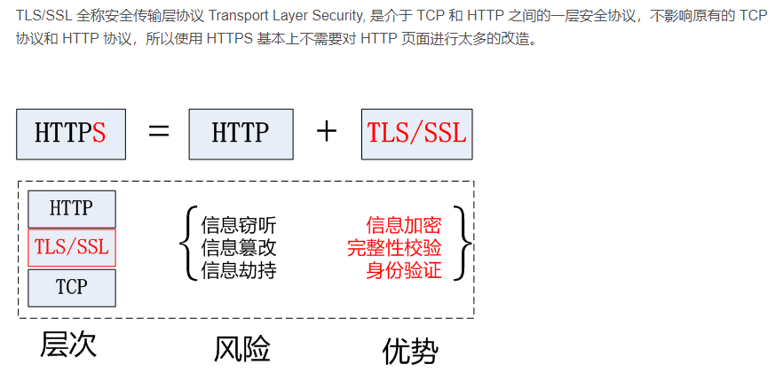

   #### SSL相关的加密算法？

   **对称加密算法**

   对称加密算法用来对敏感数据等信息进行加密，常用的算法包括：

   DES（Data Encryption Standard）：数据加密标准，速度较快，适用于加密大量数据的场合。

   3DES（Triple DES）：是基于DES，对一块数据用三个不同的密钥进行三次加密，强度更高。

   AES（Advanced Encryption Standard）：高级加密标准，是下一代的加密算法标准，速度快，安全级别高；

   **非对称算法**

   常见的非对称加密算法如下：

   RSA：由 RSA 公司发明，是一个支持变长密钥的公共密钥算法，需要加密的文件块的长度也是可变的；

   DSA（Digital Signature Algorithm）：数字签名算法，是一种标准的 DSS（数字签名标准）；

   ECC（Elliptic Curves Cryptography）：椭圆曲线密码编码学。

   

6. HTTP1.0、1.1、2.0区别

   - HTTP1.0：Client和server连接后只能获得一个web资源，不支持断点续传
   - HTTP1.1：在一个连接上获取多个web资源，可以传送多个HTTP响应和请求，支持持久化连接，断点续传，引入更多缓存策略，FIFO处理请求-响应
   - HTTP2.0：进行了二进制分帧，封装了HTTP消息，这些帧对应着逻辑流中的消息，很多流可以并行地在同一个TCP连接上交换消息，支持多向请求与响应：客户端和服务器可以把HTTP消息分解为互不依赖的帧，然后乱序发送，最后再在另一端把它们重新组合起来。

7. HTTP断点续传

   http1.1协议支持获取文件的**部分内容**，为并行下载和断点续传提供了技术支持，通过在Header 里两个参数实现的，客户端发请求时对应的是 **Range** ，服务器端响应时对应的是 **Content-Range**

   增强校验

   发起续传请求时，所对应的文件内容变化，此时需要定义一个标记文件唯一性的方法，服务器端用Last-Modified 来标识文件的最后修改时间，同时还定义一个 ETag 头，可以使用 ETag 头来放置文件的唯一标识(标记文件是否被修改)。

   客户端在发起续传请求时在HTTP头中申明If-Match 或者If-Modified-Since 字段，帮助服务端判别文件变化。

   HTTP还定义有一个If-Range头，终端如果在续传是使用If-Range。If-Range中的内容可以为最初收到的ETag头或者是Last-Modfied中的最后修改时候。服务端在收到续传请求时，通过If-Range中的内容进行校验，校验一致时返回206的续传回应，不一致时服务端则返回200回应，回应的内容为新的文件的全部数据。

### DNS域名解析

1. 产生原因

   DNS是应用层协议：网络通信使用TCP/IP，基于IP地址，只能识别ip地址，不认识域名，因此通过DNS服务器解析域名，DNS包括域名解析器和域名服务器。

2. DNS寻址过程

   1. 在浏览器中输入www.qq.com域名，操作系统会先检查自己本地的hosts文件是否有这个网址映射关系，如果有，就先调用这个IP地址映射，完成域名解析。
   2. 如果hosts里没有这个域名的映射，则查找本地DNS解析器缓存，是否有这个网址映射关系，如果有，直接返回，完成域名解析。
   3. 如果hosts与本地DNS解析器缓存都没有相应的网址映射关系，首先会找TCP/ip参数中设置的首选DNS服务器，在此我们叫它本地DNS服务器，此服务器收到查询时，如果要查询的域名，包含在本地配置区域资源中，则返回解析结果给客户机，完成域名解析，此解析具有权威性。
   4. 如果要查询的域名，不由本地DNS服务器区域解析，但该服务器已缓存了此网址映射关系，则调用这个IP地址映射，完成域名解析，此解析不具有权威性。
   5. 如果本地DNS服务器本地区域文件与缓存解析都失效，则根据本地DNS服务器的设置（是否设置转发器）进行查询，如果未用转发模式，本地DNS就把请求发至13台根DNS，根DNS服务器收到请求后会判断这个域名(.com)是谁来授权管理，并会返回一个负责该顶级域名服务器的一个IP。本地DNS服务器收到IP信息后，将会联系负责.com域的这台服务器。这台负责.com域的服务器收到请求后，如果自己无法解析，它就会找一个管理.com域的下一级DNS服务器地址(qq.com)给本地DNS服务器。当本地DNS服务器收到这个地址后，就会找qq.com域服务器，重复上面的动作，进行查询，直至找到www.qq.com主机。
   6. 如果用的是转发模式，此DNS服务器就会把请求转发至上一级DNS服务器，由上一级服务器进行解析，上一级服务器如果不能解析，或找根DNS或把转请求转至上上级，以此循环。不管是本地DNS服务器用是是转发，还是根提示，最后都是把结果返回给本地DNS服务器，由此DNS服务器再返回给客户机。

   从客户端到本地DNS服务器是属于递归查询，而DNS服务器之间的交互查询就是迭代查询。

   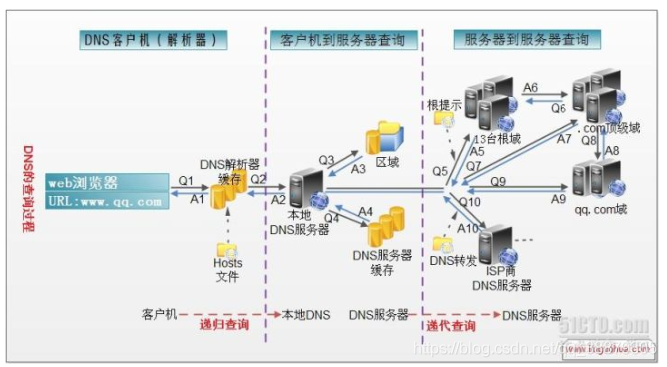

3. DNS服务器为什么使用分布式？

   集中式简单，但会出现单点故障，有延迟，维护开销大，因此使用分布式的**层次数据库模式**以及**缓存方法**来解决单点集中式的问题。

   **DNS服务器层次结构**

   13个根DNS服务器，顶级DNS服务器，权威DNS服务器

4. 为什么DNS使用UDP传输？

   - 一次UDP交换可以短到两个包：一个查询包、一个响应包。一次TCP交换则至少包含9个包：三次握手初始化TCP会话、一个查询包、一个响应包以及四次分手的包交换。
   - 效率：TCP连接的开销大，故采用UDP作为DNS的运输层协议，这也将导致只有13个根域名服务器的结果。

5. URL网址加载过程

   DNS解析->TCP连接->HTTP请求-响应–>url浏览器渲染

   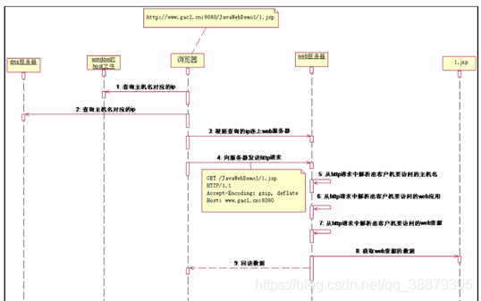

6. Scoket通信过程

   两个主机的程序之间通过套接字进行通信

   - Socket是对TCP/IP协议族的封装，是应用层和TCP/IP协议族通讯的中间软件抽象层，把复杂的TCP/IP隐藏在Socket接口后面，用户通过简单的调用socket接口让socket组织数据，已符合指定的协议
   - Socket还是一种网络间不同计算机上进程通讯的方法，网络中使用三元组**[ip地址，协议，端口]**唯一标识网络的进程，（本地使用PID标识进程　）进程通信使用这个标志和其他进程通信。

7. 请简单解释一下，arp协议和arp攻击

   地址解析协议。ARP攻击的第一步就是ARP欺骗。由上述“ARP协议的工作过程”我们知道，ARP协议基本没有对网络的安全性做任何思考，当时人们考虑的重点是如何保证网络通信能够正确和快速的完成——ARP协议工作的前提是默认了其所在的网络是一个善良的网络，每台主机在向网络中发送应答信号时都是使用的真实身份。不过后来，人们发现ARP应答中的IP地址和MAC地址中的信息是可以伪造的，并不一定是自己的真实IP地址和MAC地址，由此，ARP欺骗就产生了。

8. 什么是icmp协议，它的作用是什么？

   它是TCP/IP协议族的一个子协议，用于在IP主机、路由器之间传递控制消息。控制消息是指网络通不通、主机是否可达、路由是否可用等网络本身的消息。这些控制消息虽然并不传输用户数据，但是对于用户数据的传递起着重要的作用。

### SSL具体协商密钥的过程

TLS/SSL 的功能实现主要依赖于三类基本算法：散列函数 Hash、对称加密和非对称加密，其利用非对称加密实现身份认证和密钥协商，对称加密算法采用协商的密钥对数据加密，基于散列函数验证信息的完整性。

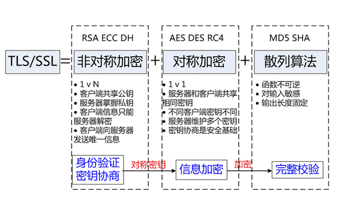

结合三类算法的特点，TLS 的基本工作方式是，客户端使用非对称加密与服务器进行通信，实现身份验证并协商对称加密使用的密钥，然后对称加密算法采用协商密钥对信息以及信息摘要进行加密通信，不同的节点之间采用的对称密钥不同，从而可以保证信息只能通信双方获取。

#### CA

解决身份验证问题的关键是确保获取的公钥途径是合法的，能够验证服务器的身份信息，为此需要引入权威的第三方机构 CA。CA 负责核实公钥的拥有者的信息，并颁发认证”证书”，同时能够为使用者提供证书验证服务，即 PKI 体系。

基本的原理为，CA 负责审核信息，然后对关键信息利用私钥进行”签名”，公开对应的公钥，客户端可以利用公钥验证签名。CA 也可以吊销已经签发的证书，基本的方式包括两类 CRL 文件和 OCSP。CA 使用具体的流程如下：

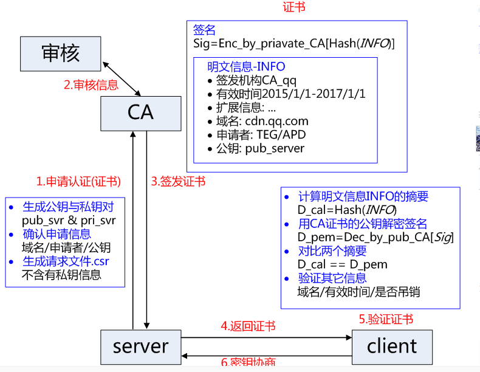


### 两个局域网通过一个公共网络连接 之间怎么进行ip寻路的（非广播式）

路由器的核心是全局路由表，通过路由器的所有数据转发都要经过全局路由表来实现。

路由选择就是路由器依据目的IP地址的网络地址部分，通过路由选择算法确定一条从源结点到达目的结点的最佳路由。 

路由器通过路由协议，网络连接的情况及网络的性能来建立网络的拓扑结构。路由算法为网络上的路由产生一个权值，路由器通过权值来选择最佳路径，权值越小，路由最佳。 
对于一台路由器，其分组转发的任务即是在收到数据包后，根据路由表所提供的最佳路径的信息，将其转发给下一条的路由器，目的端口或是缺省路由器。缺省路由器也称缺省开关，它是与主机在同一个子网中的路由端口的IP地址。 

#### 路由器可以分为两个功能层面

1.控制层面：形成和维护全局路由表

2.转发层面：根据形成的全局路由表来实现数据转发

而控制层面和转发层面的接口就是全局路由表

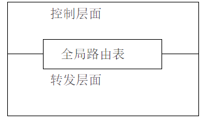

#### 那么控制层面如何形成路由表？

\1.  直连路由：只要路由器接口UP了那么这个接口所在的网段会自动进入全局路由表中。

\2.  静态路由：通过静态路由手工配置

\3.  动态路由：通过动态路由协议学习到的（ospf，rip）

 

#### 全局路由表包含什么？

全局路由表中包含的以下5个最为重要的项目

\1.  通过何种方式学习

\2.  目标网段

\3.  目标网段子网掩码

\4.  出接口

\5.  下一跳地址

#### 转发层面如何根据全局路由表来转发IP数据包

1最长掩码匹配原则（选择所有匹配路由中，子网掩码最长的那条进行数据转发）

 

2.递归查找（如图）

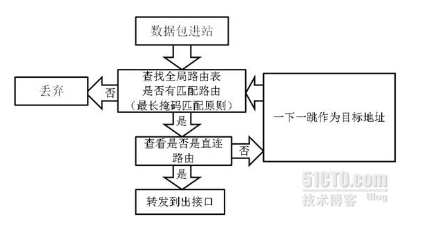


4. IP转发是逐跳进行的，每一条都要查找全局路由表，通过递归算法知道查到下一跳为直连，才会把数据包发往该出接口。且每转发一次TTL值-1。TTL值为0是数据包会被丢弃

如下分析

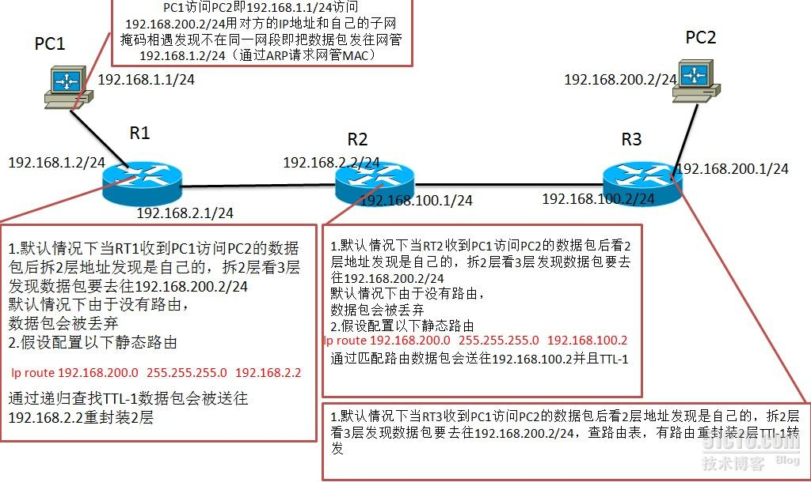

#### 两个著名的动态路由协议： 

RIP（路由信息协议）：基于距离矢量算法，它选择路由的度量标准（metric)是跳数，最大跳数是15跳，如果大于15跳，它就会丢弃数据包。 
缺点： 
1). RIP的15跳限制，超过15跳的路由被认为不可达 
2). RIP不能支持可变长子网掩码(VLSM)，导致IP地址分配的低效率 
3). 周期性广播整个路由表，在低速链路及广域网云中应用将产生很大问题 
4). 收敛速度慢于OSPF，在大型网络中收敛时间需要几分钟 
5). RIP没有网络延迟和链路开销的概念，路由选路基于跳数。拥有较少跳数的路由总是被选为最佳路由即使较长的路径有低的延迟和开销 
6). RIP没有区域的概念，不能在任意比特位进行路由汇

OSPF（开放式最短路径优先）：基于链路状态及最短路径树算法，较之RIP略显复杂。 
优点： 
1).没有跳数的限制 
2).支持可变长子网掩码(VLSM) 
3).使用组播发送链路状态更新，在链路状态变化时使用触发更新，提高了带宽的利用率 
4).收敛速度快，状态更新能快速覆盖整个网络。 
5).具有认证功能


## SSL加密过程

SSL英文全称Secure Socket Layer，安全套接层，是一种为网络通信提供安全以及数据完整性的安全协议，它在传输层对网络进行加密。它主要是分为两层：

​	-SSL记录协议：为高层协议提供安全封装、压缩、加密等基本功能
​	-SSL握手协议：用于在数据传输开始前进行通信双方的身份验证、加密算法的协商、交换密钥

SSL加密

过程：

1.利用非对称加密使客户端得到服务端的公钥（数字证书）；

2.利用服务端公钥协商对称加密的私钥；

3.利用对称加密传输数据；


数字证书的验证过程

第一步 ：客户端A开启一个新的浏览器访问客户端时，会先让A安装一个数字证书，这个证书主要包含的是CA机构的公钥。
第二步：服务端B发来CA机构给自己的证书，通过CA公钥解密被CA私钥加密的hash1，然后再用B的证书里面的hash算法将信息生成一个hash2，通过比较两个hash，若相等，确认这个数字证书是服务端B的。
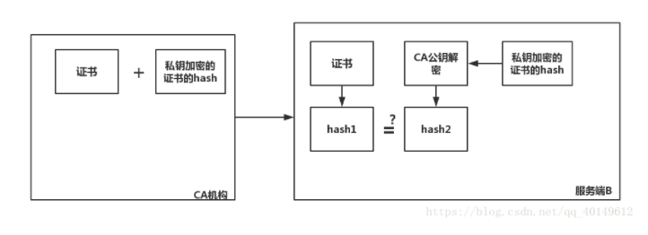

SSL握手过程：

第一步 客户端A给出 支持的SSL版本+一个随机数+自己支持的加密方式
第二步 服务端B接收到这些信息后确认加密方式+自己的安全证书+一个随机数发给A
第三步 客户端A确认数字证书有效性（验证方法上面已经说明），然后生成一个随机数，并将这个随机数用B的数字证书公钥加密后发送给A。
第四步 服务端B使用自己的私钥解密这个随机数
第五步 A和B通过第二步确定的加密方法将前三个随机数生成一个对话密钥 用来接下来的通信（个人感觉不需要三个随机数，只用最后一个就够了，这样做可能是为了更安全）

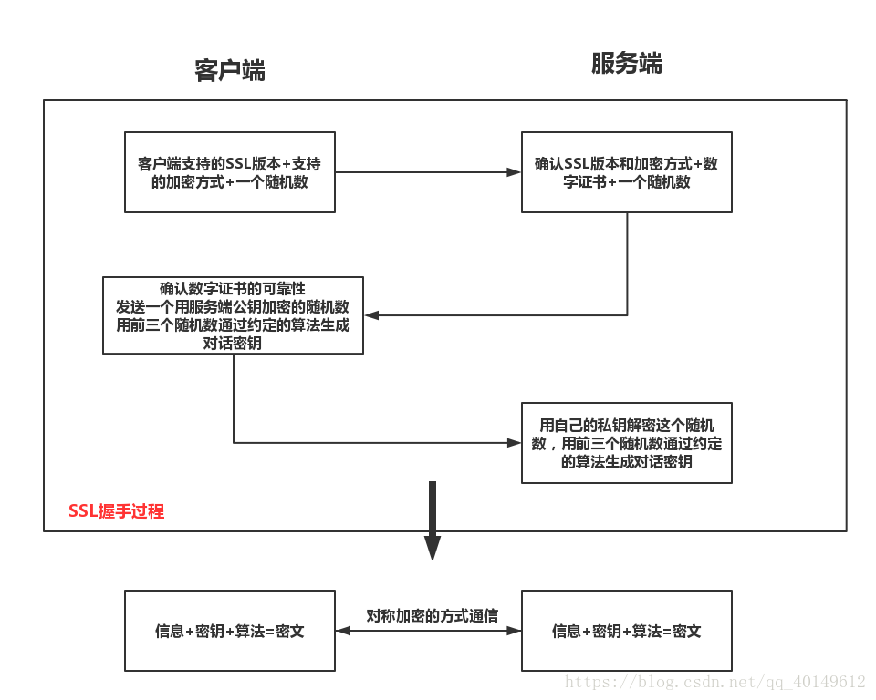


需要掌握的网络协议和知识：

- HTTP、TCP、IP、ICMP、UDP、DNS、ARP
- IP地址、MAC地址、OSI七层模型（或者 TCP/IP 五层模型）
- 常见网络攻击：局域网ARP泛洪、DDoS、TCP SYN Flood、XSS等
- HTTPS安全相关的：数字签名、数字证书、TLS
- HTTP常见返回码含义，HTTP1.0、2.0区别等

TCP的重点知识：

- 三次握手、四次挥手
  
- 建立、断开连接过程中状态转换
  
- TCP 状态中 TIME_WAIT
  
- 拥塞控制
  
- 快速重传、慢启动等
  
- TCP重发机制，Nagle算法

**学习过程中也要多思考为什么要这么设计，这里列几个问题：**

- TCP 如何实现可靠传输的（画外音：如何基于 UDP 实现可靠传输
- 第二次和第三次之间的等待是什么
- TCP 连接建立为什么不是两次握手（画外音：三次握手的充分必要性说明
- TIME_WAIT 的存在解决了什么问题，等待时间为什么是 2 MSL
- 为什么不是四次握手

**常见端口与服务：**

21 : FTP - 文件传输协议 - TCP

23 : TELNET - 远程登录协议 - TCP

25 : SMTP - 简单邮件传输协议 - TCP

80 : HTTP - 超文本传输协议 - TCP

53 : DNS - 域名系统 - UDP

**最后别忘了自己复述一遍那被问烂了、写烂了的问题：**

- **从 URL 输入到页面展现到底发生什么？**

HTTP 和 HTTPS：

- HTTP中GET/POST的区别
- 常见的状态码：1XX、2XX、3XX、4XX
- HTTP/HTTPS的区别，证书、数字签名等原理
- COOKIE/SESSION的区别

**但是计网中还是有一些有意思的问题，如果你没思考过，也许回答不出来。**

比如：

- 为什么有了 MAC 地址还要 IP 地址，IP 地址和 MAC 地址的区别是什么？
- 如何理解广播域和冲突域？
- 路由器和交换机有什么区别？
- TCP 连接的本质是什么，真的是“链接”吗？（曾经被问过：Java socket 创建的 TCP 连接，对于主机挂了和 JVM 挂了有什么区别？

# 数据库篇

## 索引

**索引是一种用于快速查询和检索数据的数据结构。**常见的索引结构有: **B 树， B+树和 Hash。**

在关系数据库中，*索引*是一种单独的、物理的对数据库表中一列或多列的值进行排序的一种存储结构。

如果不使用索引，要进行全表扫描才可以实现数据的查询，对于一个较大的表或者相对复杂的查询条件而言，时间都非常长。

### 索引的优缺点

**优点** ：

- 使用索引可以大大加快 数据的检索速度（大大减少的检索的数据量）, 这也是创建索引的最主要的原因。
- 通过创建唯一性索引，可以保证数据库表中每一行数据的唯一性。

**缺点** ：

- 创建索引和维护索引需要耗费许多时间。当对表中的数据进行增删改的时候，如果数据有索引，那么索引也需要动态的修改，会降低 SQL 执行效率。
- 索引需要使用物理文件存储，也会耗费一定空间。

但是，**使用索引一定能提高查询性能吗?**

大多数情况下，索引查询都是比全表扫描要快的。但是如果数据库的数据量不大，那么使用索引也不一定能够带来很大提升。

### 索引的分类

索引只是为了加速查询，只要是能增加查询速度的都可以作为索引。

- Hash索引

  哈希索引是很常见的一种加速，查询效率是O(1)，缺点是没有办法对范围查询进行优化。K-V型数据库就是类似的思路，加速查询。

- 平衡二叉查找树（B+树索引）

  二叉查找树就是左子树<节点<右子树的二叉树，理想情况下二叉查找树的查询效率是O(logn)。

  二叉查找树的查询效率依赖于它的结构，有可能退化为单链表，查找效率退化到O(n)。

  广义的平衡二叉树就是考虑到这种情况，而对二叉树的结构进行限制，要求二叉查找树必须满足一些性质，例如左右子树高度差不能太大等等。
  
  
  
  Mysql不使用hash索引的原因：
  
  1.hash冲突；
  
  2.无法范围查询；
  
  使用B+树而不用红黑树的原因：
  
  1.B+树中间的节点存的都是索引，所以节点能存更多索引数据，树高相对较矮，I/O效率高；
  
  2.红黑树不支持范围索引；

### 索引类型

#### 主键索引(Primary Key)

数据表的主键列使用的就是主键索引。

一张数据表有只能有一个主键，并且主键不能为 null，不能重复。

在 MySQL 的 InnoDB 的表中，当没有显示的指定表的主键时，InnoDB 会自动先检查表中是否有唯一索引的字段，如果有，则选择该字段为默认的主键，否则 InnoDB 将会自动创建一个 6Byte 的自增主键。

#### 二级索引(辅助索引)

**二级索引又称为辅助索引，是因为二级索引的叶子节点存储的数据是主键。也就是说，通过二级索引，可以定位主键的位置。**

唯一索引，普通索引，前缀索引等索引属于二级索引。

**PS:不懂的同学可以暂存疑，慢慢往下看，后面会有答案的，也可以自行搜索。**

1. **唯一索引(Unique Key)** ：唯一索引也是一种约束。**唯一索引的属性列不能出现重复的数据，但是允许数据为 NULL，一张表允许创建多个唯一索引。** 建立唯一索引的目的大部分时候都是为了该属性列的数据的唯一性，而不是为了查询效率。
2. **普通索引(Index)** ：**普通索引的唯一作用就是为了快速查询数据，一张表允许创建多个普通索引，并允许数据重复和 NULL。**
3. **前缀索引(Prefix)** ：前缀索引只适用于字符串类型的数据。前缀索引是对文本的前几个字符创建索引，相比普通索引建立的数据更小， 因为只取前几个字符。
4. **全文索引(Full Text)** ：全文索引主要是为了检索大文本数据中的关键字的信息，是目前搜索引擎数据库使用的一种技术。Mysql5.6 之前只有 MYISAM 引擎支持全文索引，5.6 之后 InnoDB 也支持了全文索引。

二级索引: 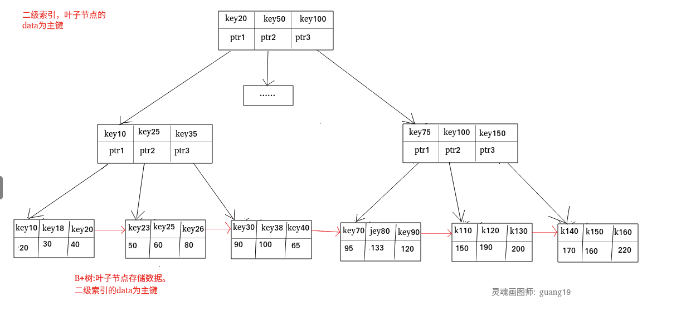

### 聚集索引与非聚集索引

#### 聚集索引

**聚集索引即索引结构和数据一起存放的索引。主键索引属于聚集索引。**

在 Mysql 中，InnoDB 引擎的表的 `.ibd`文件就包含了该表的索引和数据，对于 InnoDB 引擎表来说，该表的索引(B+树)的每个非叶子节点存储索引，叶子节点存储索引和索引对应的数据。

##### 聚集索引的优点

聚集索引的查询速度非常的快，因为整个 B+树本身就是一颗多叉平衡树，叶子节点也都是有序的，定位到索引的节点，就相当于定位到了数据。

##### 聚集索引的缺点

1. **依赖于有序的数据** ：因为 B+树是多路平衡树，如果索引的数据不是有序的，那么就需要在插入时排序，如果数据是整型还好，否则类似于字符串或 UUID 这种又长又难比较的数据，插入或查找的速度肯定比较慢。
2. **更新代价大** ： 如果对索引列的数据被修改时，那么对应的索引也将会被修改， 而且况聚集索引的叶子节点还存放着数据，修改代价肯定是较大的， 所以对于主键索引来说，主键一般都是不可被修改的。

#### 非聚集索引

**非聚集索引即索引结构和数据分开存放的索引。**

**二级索引属于非聚集索引。**

> MYISAM 引擎的表的.MYI 文件包含了表的索引， 该表的索引(B+树)的每个叶子非叶子节点存储索引， 叶子节点存储索引和索引对应数据的指针，指向.MYD 文件的数据。
>
> **非聚集索引的叶子节点并不一定存放数据的指针， 因为二级索引的叶子节点就存放的是主键，根据主键再回表查数据。**

##### 非聚集索引的优点

**更新代价比聚集索引要小** 。非聚集索引的更新代价就没有聚集索引那么大了，非聚集索引的叶子节点是不存放数据的

##### 非聚集索引的缺点

1. 跟聚集索引一样，非聚集索引也依赖于有序的数据
2. **可能会二次查询(回表)** :这应该是非聚集索引最大的缺点了。 当查到索引对应的指针或主键后，可能还需要根据指针或主键再到数据文件或表中查询。

这是 MySQL 的表的文件截图:


聚集索引和非聚集索引:


##### 非聚集索引一定回表查询吗(覆盖索引)?

**非聚集索引不一定回表查询。**

> 试想一种情况，用户准备使用 SQL 查询用户名，而用户名字段正好建立了索引。

```text
 SELECT name FROM table WHERE name='guang19';Copy to clipboardErrorCopied
```

> 那么这个索引的 key 本身就是 name，查到对应的 name 直接返回就行了，无需回表查询。

**即使是 MYISAM 也是这样，虽然 MYISAM 的主键索引确实需要回表， 因为它的主键索引的叶子节点存放的是指针。但是如果 SQL 查的就是主键呢?**

```text
SELECT id FROM table WHERE id=1;Copy to clipboardErrorCopied
```

主键索引本身的 key 就是主键，查到返回就行了。这种情况就称之为覆盖索引了。

### 覆盖索引

如果一个索引包含（或者说覆盖）所有需要查询的字段的值，我们就称之为“覆盖索引”。我们知道在 InnoDB 存储引擎中，如果不是主键索引，叶子节点存储的是主键+列值。最终还是要“回表”，也就是要通过主键再查找一次。这样就会比较慢覆盖索引就是把要查询出的列和索引是对应的，不做回表操作！

**覆盖索引即需要查询的字段正好是索引的字段，那么直接根据该索引，就可以查到数据了， 而无需回表查询。**

> 如主键索引，如果一条 SQL 需要查询主键，那么正好根据主键索引就可以查到主键。
>
> 再如普通索引，如果一条 SQL 需要查询 name，name 字段正好有索引， 那么直接根据这个索引就可以查到数据，也无需回表。

覆盖索引: 

### 创建索引的注意事项

**1.选择合适的字段创建索引：**

- **不为 NULL 的字段** ：索引字段的数据应该尽量不为 NULL，因为对于数据为 NULL 的字段，数据库较难优化。如果字段频繁被查询，但又避免不了为 NULL，建议使用 0,1,true,false 这样语义较为清晰的短值或短字符作为替代。
- **被频繁查询的字段** ：我们创建索引的字段应该是查询操作非常频繁的字段。
- **被作为条件查询的字段** ：被作为 WHERE 条件查询的字段，应该被考虑建立索引。
- **频繁需要排序的字段** ：索引已经排序，这样查询可以利用索引的排序，加快排序查询时间。
- **被经常频繁用于连接的字段** ：经常用于连接的字段可能是一些外键列，对于外键列并不一定要建立外键，只是说该列涉及到表与表的关系。对于频繁被连接查询的字段，可以考虑建立索引，提高多表连接查询的效率。

**2.被频繁更新的字段应该慎重建立索引。**

虽然索引能带来查询上的效率，但是维护索引的成本也是不小的。 如果一个字段不被经常查询，反而被经常修改，那么就更不应该在这种字段上建立索引了。

**3.尽可能的考虑建立联合索引而不是单列索引。**

因为索引是需要占用磁盘空间的，可以简单理解为每个索引都对应着一颗 B+树。如果一个表的字段过多，索引过多，那么当这个表的数据达到一个体量后，索引占用的空间也是很多的，且修改索引时，耗费的时间也是较多的。如果是联合索引，多个字段在一个索引上，那么将会节约很大磁盘空间，且修改数据的操作效率也会提升。

**4.注意避免冗余索引** 。

冗余索引指的是索引的功能相同，能够命中索引(a, b)就肯定能命中索引(a) ，那么索引(a)就是冗余索引。如（name,city ）和（name ）这两个索引就是冗余索引，能够命中前者的查询肯定是能够命中后者的 在大多数情况下，都应该尽量扩展已有的索引而不是创建新索引。

**5.考虑在字符串类型的字段上使用前缀索引代替普通索引。**

前缀索引仅限于字符串类型，较普通索引会占用更小的空间，所以可以考虑使用前缀索引带替普通索引。

## 事务

### ACID原则

#### Atom原子性

事务被视为不可分割的最小单元，事务的所有操作要么全部提交成功，要么全部失败回滚。

回滚可以用回滚日志（Undo Log）来实现，回滚日志记录着事务所执行的修改操作，在回滚时反向执行这些修改操作即可。

#### Consistency一致性

执行事务前后，数据保持一致，例如转账业务中，无论事务是否成功，转账者和收款人的总额应该是不变的；

数据库在事务执行前后都保持一致性状态。在一致性状态下，所有事务对同一个数据的读取结果都是相同的。

#### Isolation 隔离性

并发访问数据库时，一个用户的事务不被其他事务所干扰，各并发事务之间数据库是独立的；

一个事务所做的修改在最终提交以前，对其它事务是不可见的。

#### Deterministic持久性

一旦事务提交，则其所做的修改将会永远保存到数据库中。即使系统发生崩溃，事务执行的结果也不能丢失。

系统发生崩溃可以用重做日志（Redo Log）进行恢复，从而实现持久性。与回滚日志记录数据的逻辑修改不同，重做日志记录的是数据页的物理修改。

### 一致性问题：

为了提高并发事务的高效处理，我们选择了舍弃一部分隔离性来换取性能。但这样同时导致了一致性问题。

如：脏写、脏读、不可重复读、幻读。（排序为严重程度）

#### 脏写：

即一个事务修改了另一个未提交事务修改过的数据。（影响最严重，各个隔离级别都不允许这种情况发生）

#### 脏读：

即一个事务读到了另一个未提交事务修改过的数据。

#### 不可重复读：

即一个事务修改了另一个未提交事务读取的数据。

#### 幻读：

即一个事务查询未提交的数据被另一个事务插入了一条/多条满足查询条件的数据。

### 隔离级别：

即被舍弃的隔离性程度，级别越低越可能发生更严重的问题。以下为隔离级别由低到高介绍：

#### 读未提交 Read Uncommited

未提交的事务影响的数据也可以被读取，这会造成**脏读**：事务A修改了变量但是还没提交，这个时候事务B读取就会得到脏数据。如果A提交了就无事发生，如果A回滚了B就凉凉。

#### 读已提交Read Commited

假如只能读取已提交的事务结果，就不会造成脏读。

但是如果一个很长的事务B反复查询一个数值，这个事务过程中事务A修改了这个数值并提交，这就会导致事务B读到的数值不可重复读。

#### 可重复读Repeatable Read

MySQL的默认隔离级别是可重复读。

可重复读通常通过快照来实现，多版本并发控制MVCC，每次都读当时的值即可。

即使可以重复读，也可能造成幻读。不可重复读针对一个值，幻读针对一组记录。比如查询满足条件的行数，事务过程中别的事务提交了新的记录，多次查询行数就不同。幻读不能通过MVCC解决。

同时还有可能出现写偏差，写偏差是指逻辑上查询数据和写入数据有关联，并发状态下可能会导致写偏差：因为读写时间的差异导致写入数据的时读取条件已经改变。例如抢票。

#### 可串行化

串行化是最严格的控制，串行之后一定不会出现上面的问题，只需要保证事务内部的一致性。串行化比较慢，影响效率，通常会对其作出妥协。

**隔离级别与可能发生的现象：**

| 隔离级别       | 脏读   | 不可重复读 | 幻读   |
| -------------- | ------ | ---------- | ------ |
| 读未提交（RU） | 可能   | 可能       | 可能   |
| 读已提交（RC） | 不可能 | 可能       | 可能   |
| 可重复读（RR） | 不可能 | 不可能     | 可能   |
| 可串行化       | 不可能 | 不可能     | 不可能 |

 **InnoDB如何解决幻读问题？**

在只有快照读时InnoDB不会发生幻读，因为MVCC机制；

当既有快照读又有当前读时，可以利用临键锁（next-lock）来避免幻读；

## 锁

### **表级锁和行级锁对比：**

|        | 表级锁         | 行级锁     |
| ------ | -------------- | ---------- |
| 粒度   | 粒度最大       | 粒度最小   |
| 开销   | 开销小         | 开销大     |
| 并发度 | 并发度最低     | 并发度高   |
| 锁冲突 | 锁冲突概率最高 | 锁冲突较低 |
| 死锁   | 不会死锁       | 会死锁     |

- **表级锁：** MySQL 中锁定 **粒度最大** 的一种锁，对当前操作的整张表加锁，实现简单，资源消耗也比较少，加锁快，不会出现死锁。其锁定粒度最大，触发锁冲突的概率最高，并发度最低，MyISAM 和 InnoDB 引擎都支持表级锁。
- **行级锁：** MySQL 中锁定 **粒度最小** 的一种锁，只针对当前操作的行进行加锁。 行级锁能大大减少数据库操作的冲突。其加锁粒度最小，并发度高，但加锁的开销也最大，加锁慢，会出现死锁。

**InnoDB 存储引擎的锁的算法有三种：**

- Record lock：单个行记录上的锁
- Gap lock：间隙锁，锁定一个范围，不包括记录本身
- Next-key lock：record+gap 锁定一个范围，包含记录本身

### 乐观锁


### 悲观锁

对于频繁写冲突的业务，用乐观锁肯定是不太好的，重试操作会增加各种开销，此时可以考虑使用悲观锁。对于写冲突较少发生的场景，那乐观锁就非常适合了。

## 内存引擎

### MVCC

多版本并发控制（Multi-Version Concurrency Control, MVCC）是 MySQL 的 InnoDB 存储引擎实现隔离级别的一种具体方式，用于实现提交读和可重复读这两种隔离级别。而未提交读隔离级别总是读取最新的数据行，要求很低，无需使用 MVCC。可串行化隔离级别需要对所有读取的行都加锁，单纯使用 MVCC 无法实现。

### MyISAM与InnoDB 的区别

|           | InnoDB                         | MyISAM             |
| --------- | ------------------------------ | ------------------ |
| 行/表级锁 | 行表都支持；默认行级锁         | 仅支持表级锁       |
| 事务      | 支持事务                       | 不支持事务         |
| 外键      | 支持外键                       | 不支持外键         |
| 崩溃恢复  | 支持崩溃后安全恢复（redo-log） | 不支持崩溃恢复     |
| MVCC      | 支持MVCC                       | 不支持MVCC         |
| 索引      | 聚簇索引                       | 非聚簇索引         |
| 叶子结点  | 存的数据文件                   | 存的数据文件的指针 |

MySQL InnoDB 引擎

- 使用 **redo log(重做日志)** 保证事务的**持久性**，
- 使用 **undo log(回滚日志)** 来保证事务的**原子性**。
- 使用 **锁机制**、**MVCC** 等手段来保证事务的**隔离性**（ 默认支持的隔离级别是 **`REPEATABLE-READ`** 可重复读）。
- 保证了事务的持久性、原子性、隔离性之后，一致性才能得到保障。


1. InnoDB支持事务，MyISAM不支持，InnoDB 具有提交(commit)和回滚(rollback)事务的能力。对于InnoDB每一条SQL语言都默认封装成事务，自动提交，这样会影响速度，所以最好把多条SQL语言放在begin和commit之间，组成一个事务； 

2. InnoDB支持外键，而MyISAM不支持。对一个包含外键的InnoDB表转为MYISAM会失败； 

3. InnoDB是聚集索引，使用B+Tree作为索引结构，数据文件是和（主键）索引绑在一起的（表数据文件本身就是按B+Tree组织的一个索引结构），必须要有主键，通过主键索引效率很高。但是辅助索引需要两次查询，先查询到主键，然后再通过主键查询到数据。因此，主键不应该过大，因为主键太大，其他索引也都会很大。

   MyISAM是非聚集索引，也是使用B+Tree作为索引结构，索引和数据文件是分离的，索引保存的是数据文件的指针。主键索引和辅助索引是独立的。

   也就是说：**InnoDB的B+树主键索引的叶子节点就是数据文件，辅助索引的叶子节点是主键的值；而MyISAM的B+树主键索引和辅助索引的叶子节点都是数据文件的地址指针。**

5. InnoDB不保存表的具体行数，执行select count(\*) from table时需要全表扫描。而MyISAM用一个变量保存了整个表的行数，执行上述语句时只需要读出该变量即可，速度很快

6. Innodb不支持全文索引，而MyISAM支持全文索引，在涉及全文索引领域的查询效率上MyISAM速度更快高；PS：5.7以后的InnoDB支持全文索引了

7. MyISAM表格可以被压缩后进行查询操作

8. InnoDB支持表、行(默认)级锁，而MyISAM支持表级锁

   InnoDB的行锁是实现在索引上的，而不是锁在物理行记录上。潜台词是，如果访问没有命中索引，也无法使用行锁，将要退化为表锁。

  8、InnoDB表必须有唯一索引（如主键）（用户没有指定的话会自己找/生产一个隐藏列Row_id来充当默认主   键），而Myisam可以没有

  9、Innodb存储文件有frm、ibd，而Myisam是frm、MYD、MYI

 Innodb：frm是表定义文件，ibd是数据文件

Myisam：frm是表定义文件，myd是数据文件，myi是索引文件

### MyISAM与InnoDB 的应用场景

       1. 是否要支持事务，如果要请选择innodb，如果不需要可以考虑MyISAM；
    2. 如果表中绝大多数都只是读查询，可以考虑MyISAM，如果既有读也有写，请使用InnoDB。

3. 系统奔溃后，MyISAM恢复起来更困难，能否接受；

4. MySQL5.5版本开始Innodb已经成为Mysql的默认引擎(之前是MyISAM)，说明其优势是有目共睹的，如果你不知道用什么，那就用InnoDB，至少不会差。


**InnoDB 存储引擎的锁的算法有三种：**

- Record lock：单个行记录上的锁
- Gap lock：间隙锁，锁定一个范围，不包括记录本身
- Next-key lock：record+gap 锁定一个范围，包含记录本身

**InnoDB为什么推荐使用自增ID作为主键？**

  答：自增ID可以保证每次插入时B+索引是从右边扩展的，可以避免B+树和频繁合并和分裂（对比使用UUID）。如果使用字符串主键和随机主键，会使得数据随机插入，效率比较差。

**InnoDB引擎的4大特性**

​    **插入缓冲（insert buffer),二次写(double write),自适应哈希索引(ahi),预读(read ahead)**

## 外/内连接；左右连接

[左连接 ，右连接，内连接和全外连接的4者区别_灰太狼-CSDN博客_左连接](https://blog.csdn.net/weixin_39220472/article/details/81193617?ops_request_misc=%7B%22request%5Fid%22%3A%22161942836916780357254775%22%2C%22scm%22%3A%2220140713.130102334..%22%7D&request_id=161942836916780357254775&biz_id=0&utm_medium=distribute.pc_search_result.none-task-blog-2~all~sobaiduend~default-5-81193617.first_rank_v2_pc_rank_v29&utm_term=左连接%2C右连接%2C内连接%2C外连接的区别&spm=1018.2226.3001.4187)

​		left join （左连接）：返回包括左表中的所有记录和右表中连接字段相等的记录。
　　right join （右连接）：返回包括右表中的所有记录和左表中连接字段相等的记录。
　　inner join （等值连接或者叫内连接）：只返回两个表中连接字段相等的行。
　　full join （全外连接）：返回左右表中所有的记录和左右表中连接字段相等的记录。

## 当前读/快照读

**①当前读**

所有操作都加了锁，并且锁之间除了共享锁都是互斥的，如果想要增、删、改、查时都需要等待锁释放才可以，所以读取的数据都是最新的记录。

简单来说，当前读就是加了锁的，增、删、改、查，不管锁是共享锁、排它锁均为当前读。

在 MySQL 的 Innodb 存储引擎下，增、删、改操作都会默认加上锁，所以增、删、改操作默认就为当前读。

**②快照读**

快照读的出现旨在提高事务并发性，实现基于我的敌人 MVCC，简单来说快照读就是不加锁的非阻塞读，即简单的 select 操作（select * from user）。

在 Innodb 存储引擎下执行简单的 select 操作时，会记录下当前的快照读数据，之后的 select 会沿用第一次快照读的数据，即使有其它事务提交也不会影响当前的 select 结果，这就解决了不可重复读问题。

快照读读取的数据虽然是一致的，但有可能不是最新的数据而是历史数据。

## 防幻读

**通过 MVCC 解决了快照读下的幻读问题**，为什么能解决？在第一次执行简单的 select 语句就生成了一个快照，并且在后边的 select 查询都是沿用第一次快照读的结果。所以说快照读查询到的数据有可能是历史数据。


**通过 next-key lock （临键锁）解决当前读的幻读问题**，next-key lock 是 record lock 和 gap lock 的结合，锁定的是一个范围，如果查询数据为索引记录行，则只会锁定当前行，也就是说降级为 record lock。

若为范围查找时就会锁定一个范围，例如上例中 ID 为 1，3，5 查询大于 3 的数据，则会把 (3,5]，（5，∞） 进行范围锁定，其它事务在锁未释放之前是无法插入的。

从官方文档还可得知如果需要验证数据唯一性只需要给查询加上共享锁即可，也就是给 select 语句加上 in lock share mode，如果返回结果为空，则可以进行插入，并且插入的这个值肯定是唯一的。

同样也可以添加 next key lock 防止其他人同时插入相同数据，小节 5 的所有案例就是使用的 next-key lock，从这一点可以得知 next-key lock 是可以锁定表内不存在的索引。


整个数据库最重要的还是索引和并发控制（锁、MVCC等），这部分也是面试常考的：

- 索引存储结构：B树、B+树索引、Hash索引
  
- 索引的使用：主键索引、覆盖索引、最左前缀原则、索引下推等
  
- 锁：乐观锁、悲观锁、表锁，行锁，意向锁，读锁，写锁等等
  
- MySQL InnoDB MVCC 实现机制
  
- 存储引擎：InnoDB、MyISAM等，各自的优缺点
  
- 事务：ACID理论


# 网络编程篇

## I/O模型

一个输入操作通常包括两个阶段：

- 等待数据准备好
- 从内核向进程复制数据

对于一个套接字上的输入操作，第一步通常涉及等待数据从网络中到达。当所等待数据到达时，它被复制到内核中的某个缓冲区。第二步就是把数据从内核缓冲区复制到应用进程缓冲区。

Unix 有五种 I/O 模型：

- 阻塞式 I/O
- 非阻塞式 I/O
- I/O 复用（select 和 poll）
- 信号驱动式 I/O（SIGIO）
- 异步 I/O（AIO）

### 阻塞I/O

### 非阻塞I/O

### I/O多路复用

#### epoll

epoll 的描述符事件有两种触发模式：LT（level trigger）和 ET（edge trigger）。//水平触发和边沿触发

1. LT 模式
当 epoll_wait() 检测到描述符事件到达时，将此事件通知进程，进程可以不立即处理该事件，下次调用 epoll_wait() 会再次通知进程。是默认的一种模式，并且同时支持 Blocking 和 No-Blocking。

2. ET 模式
和 LT 模式不同的是，通知之后进程必须立即处理事件，下次再调用 epoll_wait() 时不会再得到事件到达的通知。

很大程度上减少了 epoll 事件被重复触发的次数，因此效率要比 LT 模式高。只支持 No-Blocking，以避免由于一个文件句柄的阻塞读/阻塞写操作把处理多个文件描述符的任务饿死。

#### select和epoll的区别

select的结构是数组；epoll是红黑树加链表；

select的时间复杂度是o(n)；epoll的时间复杂度o(1)；

select支持的最大连接数为1024；epoll无最大连接数的上限；

select消息传递**需要内核拷贝**；epoll消息传递通过**共享内存**；

select可移植性强，全平台可用；epoll只适用于Linux系统；

**select和poll的区别**

select 和 poll 的功能基本相同，不过在一些实现细节上有所不同。

- select 会修改描述符，而 poll 不会；
- select 的描述符类型使用数组实现，FD_SETSIZE 大小默认为 1024，因此默认只能监听少于 1024 个描述符。如果要监听更多描述符的话，需要修改 FD_SETSIZE 之后重新编译；而 poll 没有描述符数量的限制；
- poll 提供了更多的事件类型，并且对描述符的重复利用上比 select 高。
- 如果一个线程对某个描述符调用了 select 或者 poll，另一个线程关闭了该描述符，会导致调用结果不确定。

select 和 poll 速度都比较慢，每次调用都需要将全部描述符从应用进程缓冲区复制到内核缓冲区。

几乎所有的系统都支持 select，但是只有比较新的系统支持 poll。

#### 什么情况下select比epoll好？

1、表面上看epoll的性能最好，但是**在连接数少并且连接都十分活跃的情况下**，select和poll的性能可能比epoll好，毕竟epoll的通知机制需要很多函数回调。

2、select低效是因为每次它都需要轮询。但低效也是相对的，视情况而定，也可通过良好的设计改善 

很容易产生一种错觉认为只要用 epoll 就可以了，select 和 poll 都已经过时了，其实它们都有各自的使用场景。

### 应用场景

**select**

select 的 timeout 参数精度为微秒，而 poll 和 epoll 为毫秒，因此 select 更加适用于实时性要求比较高的场景，比如核反应堆的控制。

select 可移植性更好，几乎被所有主流平台所支持。

**poll**

poll 没有最大描述符数量的限制，如果平台支持并且对实时性要求不高，应该使用 poll 而不是 select。

**epoll**

只需要运行在 Linux 平台上，有大量的描述符需要同时轮询，并且这些连接最好是长连接。

需要同时监控小于 1000 个描述符，就没有必要使用 epoll，因为这个应用场景下并不能体现 epoll 的优势。

需要监控的描述符状态变化多，而且都是非常短暂的，也没有必要使用 epoll。因为 epoll 中的所有描述符都存储在内核中，造成每次需要对描述符的状态改变都需要通过 epoll_ctl() 进行系统调用，频繁系统调用降低效率。并且 epoll 的描述符存储在内核，不容易调试。

### 信号驱动I/O

### 异步I/O

### 五种模型的区别

- 同步 I/O：将数据从内核缓冲区复制到应用进程缓冲区的阶段（第二阶段），应用进程会阻塞。
- 异步 I/O：第二阶段应用进程不会阻塞。

同步 I/O 包括阻塞式 I/O、非阻塞式 I/O、I/O 复用和信号驱动 I/O ，它们的主要区别在第一个阶段。

非阻塞式 I/O 、信号驱动 I/O 和异步 I/O 在第一阶段不会阻塞。

## 多线程


重点知识：

Linux 下网络编程核心的包括网络 IO 和系统编程两个部分：

- 进程间通信方式： 信号量、管道、共享内存、socket 等
- 五大 IO 模型：同步、异步、阻塞、非阻塞、信号驱动
- 高性能 IO 两种模式：Reactor 和 Proactor（ 但是 Linux 下由于缺少异步 IO 支持，基本没有 Proactor
- IO 复用机制：epoll、select、poll（破解 C10K 问题的利器）
- 多线程编程：互斥锁、条件变量、读写锁、线程池等


# 数据结构与算法篇

## 栈和队列

### 栈和队列的区别？

栈与队列的相同点：

1.都是线性结构（线性表）。

2.插入操作都是限定在表尾进行。

3.都可以通过顺序结构和链式结构实现。、

4.插入与删除的时间复杂度都是O（1），在空间复杂度上两者也一样。

5.多链栈和多链队列的管理模式可以相同。

栈与队列的不同点：

1.删除数据元素的位置不同，栈的删除操作在表尾进行，队列的删除操作在表头进行。

2.应用场景不同；常见栈的应用场景包括括号问题的求解，表达式的转换和求值，函数调用和递归实现，深度优先搜索遍历等；常见的队列的应用场景包括计算机系统中各种资源的管理，消息缓冲器的管理和广度优先搜索遍历等。

3.顺序栈能够实现多栈空间共享，而顺序队列不能。

4.**栈先进后出，队列先进先出**

## B树 

B树就是多路平衡查找树，允许一个节点记录M-1个值，每两个值之间拥有一路，所以一个节点最多有M路，即M路二叉树。

B树的特点是从下向上生长。假如有一个节点在插入之后不满足M路的性质，就把中间值提取出来放到上层节点，分裂出的两个节点就作为新的两路。如果上层节点经过这个操作也不满足了，就接着分裂，直到满足。

因为B树是从下往上生长的，它总是平衡的。

## 红黑树

2-3树是最简单的B树，也就是3路B树。

对于一个3-节点，（有两个值和三个子树），如果将左值作为右值的左子树，前两个子树给新的左节点，最后一个子树给右值的右节点，就可以转换为一个二叉树。

如果我们认为右->左这条二叉树链接不算高度，那么就可以认为这个二叉树还是平衡的。

红黑树和2-3树是等价的，红黑树的红节点就是红链接指向的节点，黑节点就是2-3树的实际节点。红黑树的红节点平衡性质和2-3树的平衡性质是等价的。

红黑树是一种不严格的平衡二叉树实现，它将节点定义为红色和黑色两种。

通过约定

1. 节点可以是红色或者黑色
2. 根节点和叶子结点必须是黑色
3. 红节点的两个子节点必须都为黑色（不能连续红色）
4. 任何一个节点到每个叶子的简单路径都包含同样数目的黑色节点

红黑树保证了最长路径最多是最短路径的两倍（考虑完全没有红色和有一倍的红色），也算是O(logn)的时间复杂度。

红黑树在插入删除的时候不一定需要旋转，可能只需要染色。插入节点一定是红色，这样不会破坏性质4，然后再看满不满足性质3，如果不满足就考虑重新染色，然后向上递归处理。

## B+树

B+树是对B树的一种改进，所有的值都存储在叶子结点，且叶子结点之间构成一个循环链表，能增加全表扫描效率。


## **跳表**

[数据结构-----跳表_一个程序渣渣的小后院-CSDN博客_跳表](https://blog.csdn.net/sinat_35261315/article/details/62890796?ops_request_misc=%7B%22request%5Fid%22%3A%22161943943516780271514064%22%2C%22scm%22%3A%2220140713.130102334..%22%7D&request_id=161943943516780271514064&biz_id=0&utm_medium=distribute.pc_search_result.none-task-blog-2~all~baidu_landing_v2~default-7-62890796.first_rank_v2_pc_rank_v29&utm_term=跳表&spm=1018.2226.3001.4187)

结合链表和二分法的特点，将链表进行加工，创造一个二者的结合体：
1.链表从头节点到尾节点是有序的
2.可以进行跳跃查找（形如二分法）

## 排序算法

### 复杂度


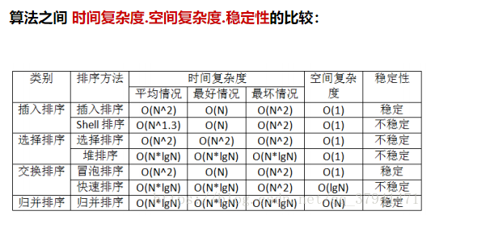

### 适用场景

设待排序元素的个数为n.
1）当n较大，则应采用时间复杂度为O(nlgn)的排序方法：快速排序、堆排序或归并排序。

​	 快速排序：是目前基于比较的内部排序中被认为是最好的方法，当待排序的关键字是随机分布时，快速排序的						平均时间最短；
 	堆排序 ：  N过大时堆排序可解决快排的递归层数过多问题。
 	归并排序：如果内存空间允许且要求稳定性的，它有一定数量的数据移动，所以我们可能过与插入排序组合，						先获得一定长度的序列，然后再合并，在效率上将有所提高。

2） 当n较大，内存空间允许，且要求稳定性 ——归并排序
3）当n较小，可采用直接插入或直接选择排序。

​	直接插入排序：当元素分布有序，直接插入排序将大大减少比较次数和移动记录的次数。 

​	直接选择排序 ：元素分布有序，如果不要求稳定性，选择直接选择排序

5）一般不使用或不直接使用传统的冒泡排序。

6）基数排序
它是一种稳定的排序算法，但有一定的局限性：
　　1、关键字可分解。
　　2、记录的关键字位数较少，如果密集更好
　　3、如果是数字时，最好是无符号的，否则将增加相应的映射复杂度，可先将其正负分开排序。

### 快排


### 归并排序


### 数组中第K大的数

1.介绍各个排序算法的时间复杂度、空间复杂度

2.快排实现原理 快排空间复杂度如何优化（讲逻辑）

3.求第K大的数怎么实现（讲逻辑） 


## 大数据小内存问题

参考链接：[海量数据处理——分治和hash映射_Smile&搁浅-CSDN博客_hash分治](https://blog.csdn.net/yangquanhui1991/article/details/52172768)

[海量数据处理 - 10亿个数中找出最大的10000个数（top K问题）_飘在上海的北方人-CSDN博客](https://blog.csdn.net/iteye_6926/article/details/82646307?utm_medium=distribute.pc_relevant.none-task-blog-2~default~BlogCommendFromMachineLearnPai2~default-2.control&depth_1-utm_source=distribute.pc_relevant.none-task-blog-2~default~BlogCommendFromMachineLearnPai2~default-2.control)

### 1.找文件中相同数据

题目描述

给定 a、b 两个文件，各存放 50 亿个 URL，每个 URL 各占 64B，内存限制是 4G。**请找出 a、b 两个文件共同的 URL。**

解答思路

每个 URL 占 64B，那么 50 亿个 URL占用的空间大小约为 320GB。

5, 000, 000, 000 * 64B ≈ 5GB * 64 = 320GB

由于内存大小只有 4G，因此，我们不可能一次性把所有 URL 加载到内存中处理。对于这种类型的题目，一般采用**分治策略** ，即：把一个文件中的 URL 按照某个特征划分为多个小文件，使得每个小文件大小不超过 4G，这样就可以把这个小文件读到内存中进行处理了。

**思路如下** ：

首先遍历文件 a，对遍历到的 URL 求 `hash(URL) % 1000` ，根据计算结果把遍历到的 URL 存储到 a0, a1, a2, ..., a999，这样每个大小约为 300MB。使用同样的方法遍历文件 b，把文件 b 中的 URL 分别存储到文件 b0, b1, b2, ..., b999 中。这样处理过后，所有可能相同的 URL 都在对应的小文件中，即 a0 对应 b0, ..., a999 对应 b999，不对应的小文件不可能有相同的 URL。那么接下来，我们只需要求出这 1000 对小文件中相同的 URL 就好了。

接着遍历 ai( `i∈[0,999]` )，把 URL 存储到一个 HashSet 集合中。然后遍历 bi 中每个 URL，看在 HashSet 集合中是否存在，若存在，说明这就是共同的 URL，可以把这个 URL 保存到一个单独的文件中。

方法总结

1. 分而治之，进行哈希取余；
2. 对每个子文件进行 HashSet 统计。

### 2.找数据是否存在

问题描述：

一个网站有 20 亿 url 存在一个黑名单中，这个黑名单要怎么存？若此时随便输入一个 url，你**如何快速判断该 url 是否在这个黑名单中**？并且需在给定内存空间（比如：500M）内快速判断出。

可能很多人首先想到的会是使用 `HashSet`，因为 `HashSet`基于 `HashMap`，理论上时间复杂度为：`O(1)`。达到了快速的目的，但是空间复杂度呢？

下面介绍一下“布隆过滤器”。

布隆过滤器（Bloom Filter）是1970年由布隆提出的。它实际上是一个很长的二进制向量和一系列随机映射函数。布隆过滤器可以用于检索一个元素是否在一个集合中。它的优点是空间效率和查询时间都比一般的算法要好的多，缺点是有一定的误识别率和删除困难。

#### **算法特点**

1、因使用哈希判断，时间效率很高。空间效率也是其一大优势。

2、有误判的可能，需针对具体场景使用。

3、因为无法分辨哈希碰撞，所以不是很好做删除操作。

#### **使用场景**

1、黑名单

2、URL去重

3、单词拼写检查

4、Key-Value缓存系统的Key校验

5、ID校验，比如订单系统查询某个订单ID是否存在，如果不存在就直接返回。

### 3.topK问题

10亿个数中找出最大的10000个数（top K问题）

针对top K类问题，通常比较好的方案是hash分治+hash_map/tree_map/set排序+小顶堆（就是上面提到的最小堆），即先将数据集按照Hash方法分解成多个小数据集，然后使用Trie树活着Hash统计每个小数据集中的query词频，之后用小顶堆求出每个数据集中出现频率最高的前K个数，最后在所有top K中求出最终的top K。

eg：有1亿个浮点数，如果找出期中最大的10000个？
最容易想到的方法是将数据全部排序，然后在排序后的集合中进行查找，最快的排序算法的时间复杂度一般为O（nlogn），如快速排序。但是在32位的机器上，每个float类型占4个字节，1亿个浮点数就要占用400MB的存储空间，对于一些可用内存小于400M的计算机而言，很显然是不能一次将全部数据读入内存进行排序的。其实即使内存能够满足要求（我机器内存都是8GB），该方法也并不高效，因为题目的目的是寻找出最大的10000个数即可，而排序却是将所有的元素都排序了，做了很多的无用功。
第二种方法为局部淘汰法，该方法与排序方法类似，用一个容器保存前10000个数，然后将剩余的所有数字——与容器内的最小数字相比，如果所有后续的元素都比容器内的10000个数还小，那么容器内这个10000个数就是最大10000个数。如果某一后续元素比容器内最小数字大，则删掉容器内最小元素，并将该元素插入容器，最后遍历完这1亿个数，得到的结果容器中保存的数即为最终结果了。此时的时间复杂度为O（n+m^2），其中m为容器的大小，即10000。

### 分治法

第三种方法是**分治法**，将1亿个数据分成100份，每份100万个数据，找到每份数据中最大的10000个，最后在剩下的100*10000个数据里面找出最大的10000个。如果100万数据选择足够理想，那么可以过滤掉1亿数据里面99%的数据。100万个数据里面查找最大的10000个数据的方法如下：用快速排序的方法，将数据分为2堆，如果大的那堆个数N大于10000个，继续对大堆快速排序一次分成2堆，如果大的那堆个数N大于10000个，继续对大堆快速排序一次分成2堆，如果大堆个数N小于10000个，就在小的那堆里面快速排序一次，找第10000-n大的数字；递归以上过程，就可以找到第1w大的数。参考上面的找出第1w大数字，就可以类似的方法找到前10000大数字了。此种方法需要每次的内存空间为10^6 *4=4MB，一共需要101次这样的比较。

### hash法

第四种方法是Hash法。如果这1亿个书里面有很多重复的数，先通过Hash法，把这1亿个数字去重复，这样如果重复率很高的话，会减少很大的内存用量，从而缩小运算空间，然后通过分治法或最小堆法查找最大的10000个数。

### 最小堆法

第五种方法采用最小堆。首先读入前10000个数来创建大小为10000的最小堆，建堆的时间复杂度为O（mlogm）（m为数组的大小即为10000），然后遍历后续的数字，并于堆顶（最小）数字进行比较。如果比最小的数小，则继续读取后续数字；如果比堆顶数字大，则替换堆顶元素并重新调整堆为最小堆。整个过程直至1亿个数全部遍历完为止。然后按照中序遍历的方式输出当前堆中的所有10000个数字。该算法的时间复杂度为O（nmlogm），空间复杂度是10000（常数）。

### 实际场景：

实际上，最优的解决方案应该是最符合实际设计需求的方案，在时间应用中，可能有足够大的内存，那么直接将数据扔到内存中一次性处理即可，也可能机器有多个核，这样可以采用多线程处理整个数据集。
下面针对不容的应用场景，分析了适合相应应用场景的解决方案。
（1）单机+单核+足够大内存
如果需要查找10亿个查询次（每个占8B）中出现频率最高的10个，考虑到每个查询词占8B，则10亿个查询次所需的内存大约是10^9 * 8B=8GB内存。如果有这么大内存，直接在内存中对查询次进行排序，顺序遍历找出10个出现频率最大的即可。这种方法简单快速，使用。然后，也可以先用HashMap求出每个词出现的频率，然后求出频率最大的10个词。
（2）单机+多核+足够大内存
这时可以直接在内存总使用Hash方法将数据划分成n个partition，每个partition交给一个线程处理，线程的处理逻辑同（1）类似，最后一个线程将结果归并。
该方法存在一个瓶颈会明显影响效率，即数据倾斜。每个线程的处理速度可能不同，快的线程需要等待慢的线程，最终的处理速度取决于慢的线程。而针对此问题，解决的方法是，将数据划分成c×n个partition（c>1），每个线程处理完当前partition后主动取下一个partition继续处理，知道所有数据处理完毕，最后由一个线程进行归并。
（3）单机+单核+受限内存
这种情况下，需要将原数据文件切割成一个一个小文件，如次啊用hash(x)%M，将原文件中的数据切割成M小文件，如果小文件仍大于内存大小，继续采用Hash的方法对数据文件进行分割，知道每个小文件小于内存大小，这样每个文件可放到内存中处理。采用（1）的方法依次处理每个小文件。
（4）多机+受限内存
这种情况，为了合理利用多台机器的资源，可将数据分发到多台机器上，每台机器采用（3）中的策略解决本地的数据。可采用hash+socket方法进行数据分发。

从实际应用的角度考虑，（1）（2）（3）（4）方案并不可行，因为在大规模数据处理环境下，作业效率并不是首要考虑的问题，算法的扩展性和容错性才是首要考虑的。算法应该具有良好的扩展性，以便数据量进一步加大（随着业务的发展，数据量加大是必然的）时，在不修改算法框架的前提下，可达到近似的线性比；算法应该具有容错性，即当前某个文件处理失败后，能自动将其交给另外一个线程继续处理，而不是从头开始处理。

top K问题很适合采用MapReduce框架解决，用户只需编写一个Map函数和两个Reduce 函数，然后提交到Hadoop（采用Mapchain和Reducechain）上即可解决该问题。具体而言，就是首先根据数据值或者把数据hash(MD5)后的值按照范围划分到不同的机器上，最好可以让数据划分后一次读入内存，这样不同的机器负责处理不同的数值范围，实际上就是Map。得到结果后，各个机器只需拿出各自出现次数最多的前N个数据，然后汇总，选出所有的数据中出现次数最多的前N个数据，这实际上就是Reduce过程。对于Map函数，采用Hash算法，将Hash值相同的数据交给同一个Reduce task；对于第一个Reduce函数，采用HashMap统计出每个词出现的频率，对于第二个Reduce 函数，统计所有Reduce task，输出数据中的top K即可。

直接将数据均分到不同的机器上进行处理是无法得到正确的结果的。因为一个数据可能被均分到不同的机器上，而另一个则可能完全聚集到一个机器上，同时还可能存在具有相同数目的数据。

以下是一些经常被提及的该类问题。
（1）有10000000个记录，这些查询串的重复度比较高，如果除去重复后，不超过3000000个。一个查询串的重复度越高，说明查询它的用户越多，也就是越热门。请统计最热门的10个查询串，要求使用的内存不能超过1GB。

（2）有10个文件，每个文件1GB，每个文件的每一行存放的都是用户的query，每个文件的query都可能重复。按照query的频度排序。

（3）有一个1GB大小的文件，里面的每一行是一个词，词的大小不超过16个字节，内存限制大小是1MB。返回频数最高的100个词。

（4）提取某日访问网站次数最多的那个IP。

（5）10亿个整数找出重复次数最多的100个整数。

（6）搜索的输入信息是一个字符串，统计300万条输入信息中最热门的前10条，每次输入的一个字符串为不超过255B，内存使用只有1GB。

（7）有1000万个身份证号以及他们对应的数据，身份证号可能重复，找出出现次数最多的身份证号。

重复问题
在海量数据中查找出重复出现的元素或者去除重复出现的元素也是常考的问题。针对此类问题，一般可以通过位图法实现。例如，已知某个文件内包含一些电话号码，每个号码为8位数字，统计不同号码的个数。

本题最好的解决方法是通过使用位图法来实现。8位整数可以表示的最大十进制数值为99999999。如果每个数字对应于位图中一个bit位，那么存储8位整数大约需要99MB。因为1B=8bit，所以99Mbit折合成内存为99/8=12.375MB的内存，即可以只用12.375MB的内存表示所有的8位数电话号码的内容。

## 布隆过滤器

参考链接：[布隆过滤器(Bloom Filter)详解 - 李玉龙 - 博客园 (cnblogs.com)](https://www.cnblogs.com/liyulong1982/p/6013002.html)

[数学之美：布隆过滤器 - 知乎 (zhihu.com)](https://zhuanlan.zhihu.com/p/72378274)

[布隆过滤器_桔梗的眼泪博客-CSDN博客_布隆过滤器](https://blog.csdn.net/weixin_40274123/article/details/93724865)

直观的说，bloom算法类似一个hash set，用来判断某个元素（key）是否在某个集合中。
和一般的hash set不同的是，这个算法无需存储key的值，对于每个key，只需要k个比特位，每个存储一个标志，用来判断key是否在集合中。

特点是**高效地插入和查询**，可以用来告诉你 **“某样东西一定不存在或者可能存在”**。

相比于传统的 List、Set、Map 等数据结构，它更高效、占用空间更少，但是缺点是其返回的结果是概率性的，而不是确切的。

### **位图（bitmap）**

布隆过滤器其中重要的实现就是位图的实现，也就是位数组，并且在这个数组中每一个位置只占有1个bit，而每个bit只有0和1两种状态。如上图bitarray所示！bitarray也叫bitmap，大小也就是布隆过滤器的大小。

假设一种有k个哈希函数，且每个哈希函数的输出范围都大于m，接着将输出值对k取余（%m）,就会得到k个[0, m-1]的值，由于每个哈希函数之间相互独立，因此这k个数也相互独立，最后将这k个数对应到bitarray上并标记为1（涂黑）。

等判断时，将输入对象经过这k个哈希函数计算得到k个值，然后判断对应bitarray的k个位置是否都为1（是否标黑），**如果有一个不为黑，那么这个输入对象则不在这个集合中，也就不是黑名单了！如果都是黑，那说明在集合中，但有可能会误**，由于当输入对象过多，而集合也就是bitarray过小，则会出现大部分为黑的情况，那样就容易发生误判！因此使用布隆过滤器是需要容忍错误率的，即使很低很低！

### **布隆过滤器重要参数计算**

通过上面的描述，我们可以知道，如果输入量过大，而bitarray空间的大小又很小，那么误判率就会上升。那么bitarray空间大小怎么确定呢？不要慌，已经有人通过数据推倒出公式了！！！哈哈，直接用～

假设输入对象个数为n，bitarray大小（也就是布隆过滤器大小）为m，所容忍的误判率p和哈希函数的个数k。计算公式如下：（**小数向上取整**）

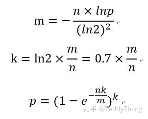


**注意：由于我们计算的m和k可能是小数，那么需要经过向上取整，此时需要重新计算误判率p！**


假设 Hash 函数以等概率条件选择并设置 Bit Array 中的某一位，m 是该位数组的大小，k 是 Hash 函数的个数，那么位数组中某一特定的位在进行元素插入时的 Hash 操作中没有被置位的概率是：

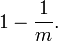

那么在所有 k 次 Hash 操作后该位都没有被置 "1" 的概率是：

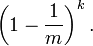

如果我们插入了 n 个元素，那么某一位仍然为 "0" 的概率是：

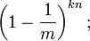

因而该位为 "1"的概率是：

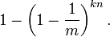

现在检测某一元素是否在该集合中。标明某个元素是否在集合中所需的 k 个位置都按照如上的方法设置为 "1"，但是该方法可能会使算法错误的认为某一原本不在集合中的元素却被检测为在该集合中（False Positives），该概率由以下公式确定：

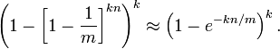

其实上述结果是在假定由每个 Hash 计算出需要设置的位（bit） 的位置是相互独立为前提计算出来的，不难看出，随着 m （位数组大小）的增加，假正例（False Positives）的概率会下降，同时随着插入元素个数 n 的增加，False Positives的概率又会上升，对于给定的m，n，如何选择Hash函数个数 k 由以下公式确定：

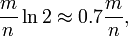

此时False Positives的概率为：

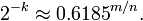

而对于给定的False Positives概率 p，如何选择最优的位数组大小 m 呢，

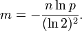

上式表明，位数组的大小最好与插入元素的个数成线性关系，对于给定的 m，n，k，假正例概率最大为：


下图是布隆过滤器假正例概率 p 与位数组大小 m 和集合中插入元素个数 n 的关系图，假定 Hash 函数个数选取最优数目：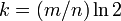

 

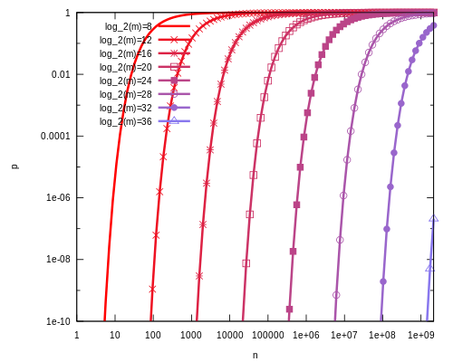

算法：
\1. 首先需要k个hash函数，每个函数可以把key散列成为1个整数
\2. 初始化时，需要一个长度为n比特的数组，每个比特位初始化为0
\3. 某个key加入集合时，用k个hash函数计算出k个散列值，并把数组中对应的比特位置为1
\4. 判断某个key是否在集合时，用k个hash函数计算出k个散列值，并查询数组中对应的比特位，如果所有的比特位都是1，认为在集合中。

### 优缺点：

优点：不需要存储key，节省空间，时间复杂度和空间复杂度都为常数级；

​			避免了大量的磁盘I/O，可以利用布隆过滤器减少磁盘 IO 或者网络请求；

缺点：
\1. 存在误报率
\2. 无法删除


重点数据结构：

- 线性表、数组、链表
- 栈与队列
- 散列函数和散列表
- 树、二叉树、多叉树实现和遍历方式，AVL树实现以及插入删除过程、红黑树（了解定义即可）
- 图，以及图的实现方式、遍历
- 堆
- B树、B+树
- 。。。

常见的算法：

- 排序算法：冒泡、插入、堆排、基数、快速、希尔、归并等
- 字符串匹配算法：KMP
- 常见算法思想：递推、分治、贪心、递归、枚举、动态规划等


