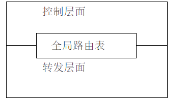

## TCP和UDP

### 1.OSI七层模型与TCP/IP五层模型

| OSI七层模型 | TCP/IP五层模型 | 功能                                   | TCP/IP协议族                  |
| ----------- | -------------- | -------------------------------------- | ----------------------------- |
| 应用层      | 应用层         | 文件传输，电子邮件，文件服务，虚拟终端 | TFTP,HTTP,SMTP,FTP,DNS,Telnet |
| 表示层      |                | 数据格式化，代码转换，数据加密         | 没有协议                      |
| 会话层      |                | 解除或建立与别的结点的联系             | 没有协议                      |
| 传输层      | 传输层         | 提供端对端的接口                       | TCP,UDP                       |
| 网络层      | 网络层         | 为数据包选择路由                       | IP,ICMP,RIP,OSPF,BCP,ICMP     |
| 数据链路层  | 数据链路层     | 传输有地址的帧以及错误检测功能         | SLIP,CSLIP,PPP,ARP,RARP,MTU   |
| 物理层      | 物理层         | 以二进制数据形式在屋里媒体上传输数据   | ISO2110,IEEE802,IEEE802.2     |

#### 帧和数据报分别位于TCP结构的哪一层？

数据帧在MAC层，数据包/IP数据报/报文分组在网络层，数据段（TCP）/数据报（UDP）在运输层，消息在应用层。

#### 为什么有MAC地址还要有I地址？

###    2.TCP和UDP区别

| TCP              | UDP                                          |
| ---------------- | -------------------------------------------- |
| 面向连接的       | 无连接的                                     |
| 可靠的           | 不可靠的                                     |
| 支持点对点通信   | 支持一对一、一对多、多对一、多对多的通信模式 |
| 面向字节流       | 面向报文                                     |
| 有拥塞控制机制   | 没有拥塞控制，适合媒体通信                   |
| 首部开销20个字节 | 首部开销8个字节                              |

### 3.三次握手

所谓三次握手（Three-Way Handshake）即建立TCP连接，就是指建立一个TCP连接时，需要客户端和服务端总共发送3个包以确认连接的建立。在socket编程中，这一过程由客户端执行connect来触发，整个流程如下图所示：

第一次握手：Client将标志位SYN置为1，随机产生一个值seq=J，并将该数据包发送给Server，Client进入SYN_SENT状态，等待Server确认。

第二次握手：Server收到数据包后由标志位SYN=1知道Client请求建立连接，Server将标志位SYN和ACK都置为1，ack=J+1，随机产生一个值seq=K，并将该数据包发送给Client以确认连接请求，Server进入SYN_RCVD状态。

第三次握手：Client收到确认后，检查ack是否为J+1，ACK是否为1，如果正确则将标志位ACK置为1，ack=K+1，并将该数据包发送给Server，Server检查ack是否为K+1，ACK是否为1，如果正确则连接建立成功，Client和Server进入ESTABLISHED状态，完成三次握手，随后Client与Server之间可以开始传输数据了。

**特点：** **SYN同步位**只有在TCP连接时才置1，连接成功后置0。

#### 4.四次挥手

四次挥手（Four-Way Wavehand）即终止TCP连接，就是指断开一个TCP连接时，需要客户端和服务端总共发送4个包以确认连接的断开。在socket编程中，这一过程由客户端或服务端任一方执行close来触发，整个流程如下图所示：

由于TCP连接时全双工的，因此，每个方向都必须要单独进行关闭，这一原则是当一方完成数据发送任务后，发送一个FIN来终止这一方向的连接，收到一个FIN只是意味着这一方向上没有数据流动了，即不会再收到数据了，但是在这个TCP连接上仍然能够发送数据，直到这一方向也发送了FIN。首先进行关闭的一方将执行主动关闭，而另一方则执行被动关闭，上图描述的即是如此。

第一次挥手：Client发送一个FIN，用来关闭Client到Server的数据传送，Client进入FIN_WAIT_1状态。

第二次挥手：Server收到FIN后，发送一个ACK给Client，确认序号为收到序号+1（与SYN相同，一个FIN占用一个序号），Server进入CLOSE_WAIT状态。

第三次挥手：Server发送一个FIN，用来关闭Server到Client的数据传送，Server进入LAST_ACK状态。

第四次挥手：Client收到FIN后，Client进入TIME_WAIT状态，接着发送一个ACK给Server，确认序号为收到序号+1，Server进入CLOSED状态，完成四次挥手。

#### 可靠传输和拥塞控制

TCP应用了所有RDT的技术，同时提供了：

- 发送窗口控制

  TCP有20字节的头部，其中就包括接收端对发送端的窗口限制（通常限制于接收端的缓存区大小）

- 重传时间限制

  包每被超时重传一次，等待时间就翻倍。

- 拥塞控制

  加性增，乘性减，慢启动。

  慢启动是指数增长到阈值，然后加性增，每收到一个确认窗口加1，遇到重传则乘性减，将阈值设为重传前窗口大小的一半。

  单位都是MSS，TCP报文段数据部分最大长度。

  超时重传直接从1开始慢启动；快速重传在早期Tahoe算法也是直接慢启动，在新版Reno算法则是减半不经历慢启动。

### TCP如何保证连接的可靠性？

TCP保证可靠性：

（1）序列号、确认应答、超时重传

数据到达接收方，接收方需要发出一个确认应答，表示已经收到该数据段，并且确认序号会说明了它下一次需要接收的数据序列号。如果发送发迟迟未收到确认应答，那么可能是发送的数据丢失，也可能是确认应答丢失，这时发送方在等待一定时间后会进行重传。这个时间一般是2*RTT(报文段往返时间）+一个偏差值。

（2）窗口控制与高速重发控制/快速重传（重复确认应答）

TCP会利用窗口控制来提高传输速度，意思是在一个窗口大小内，不用一定要等到应答才能发送下一段数据，窗口大小就是无需等待确认而可以继续发送数据的最大值。如果不使用窗口控制，每一个没收到确认应答的数据都要重发。

使用窗口控制，如果数据段1001-2000丢失，后面数据每次传输，确认应答都会不停地发送序号为1001的应答，表示我要接收1001开始的数据，发送端如果收到3次相同应答，就会立刻进行重发；但还有种情况有可能是数据都收到了，但是有的应答丢失了，这种情况不会进行重发，因为发送端知道，如果是数据段丢失，接收端不会放过它的，会疯狂向它提醒......

（3）拥塞控制

如果把窗口定的很大，发送端连续发送大量的数据，可能会造成网络的拥堵（大家都在用网，你在这狂发，吞吐量就那么大，当然会堵），甚至造成网络的瘫痪。所以TCP在为了防止这种情况而进行了拥塞控制。

慢启动：定义拥塞窗口，一开始将该窗口大小设为1，之后每次收到确认应答（经过一个rtt），将拥塞窗口大小*2。

拥塞避免：设置慢启动阈值，一般开始都设为65536。拥塞避免是指当拥塞窗口大小达到这个阈值，拥塞窗口的值不再指数上升，而是加法增加（每次确认应答/每个rtt，拥塞窗口大小+1），以此来避免拥塞。

将报文段的超时重传看做拥塞，则一旦发生超时重传，我们需要先将阈值设为当前窗口大小的一半，并且将窗口大小设为初值1，然后重新进入慢启动过程。

快速重传：在遇到3次重复确认应答（高速重发控制）时，代表收到了3个报文段，但是这之前的1个段丢失了，便对它进行立即重传。

然后，先将阈值设为当前窗口大小的一半，然后将拥塞窗口大小设为慢启动阈值+3的大小。

这样可以达到：在TCP通信时，网络吞吐量呈现逐渐的上升，并且随着拥堵来降低吞吐量，再进入慢慢上升的过程，网络不会轻易的发生瘫痪。

### 滑动窗口和拥塞控制是两种不同的方法么？是两种窗口么？

窗口分为滑动窗口和拥塞窗口。

滑动窗口是接受数据端使用的窗口大小，用来告知发送端接收端的缓存大小，以此可以控制发送端发送数据的大小，从而达到流量控制的目的。

那么对于数据的发送端就是拥塞窗口了，拥塞窗口不代表缓存，拥塞窗口指某一源端数据流在一个RTT内可以最多发送的数据包数

#### 滑动窗口

滑动窗口协议是传输层进行流控的一种措施，接收方通过通告发送方自己的可以接受缓冲区大小（这个字段越大说明网络吞吐量越高），从而控制发送方的发送速度，不过如果接收端的缓冲区一旦面临数据溢出，窗口大小值也会随之被设置一个更小的值通知给发送端，从而控制数据发送量（发送端会根据接收端指示，进行流量控制）。

#### 拥塞控制

拥塞控制：防止过多的数据注入到网络中，这样可以使网络中的路由器或链路不致过载。拥塞控制所要做的都有一个前提：网络能够承受现有的网络负荷。拥塞控制是一个全局性的过程，涉及到所有的主机、路由器，以及与降低网络传输性能有关的所有因素。

    流量控制：指点对点通信量的控制，是端到端正的问题。流量控制所要做的就是抑制发送端发送数据的速率，以便使接收端来得及接收。
    
    拥塞控制代价：需要获得网络内部流量分布的信息。在实施拥塞控制之前，还需要在结点之间交换信息和各种命令，以便选择控制的策略和实施控制。这样就产生了额外的开销。拥塞控制还需要将一些资源分配给各个用户单独使用，使得网络资源不能更好地实现共享。

然后把拥塞窗口cwnd重新设置为1，执行慢开始算法。这样做的目的就是**要迅速减少主机发送到网络中的分组数，使得发生 拥塞的路由器有足够时间把队列中积压的分组处理完毕**。

强调：“拥塞避免”并非指完全能够避免了拥塞。利用以上的措施要完全避免网络拥塞还是不可能的。“拥塞避免”是说在拥塞避免阶段将拥塞窗口控制为按线性规律增长，**使网络比较不容易出现拥塞。**

#### 两者简单比较：

相同：提高网络性能。 
不同： 
  [1].流量控制：在TCP连接上实现对发送流量的控制，考虑点对点之间对通信量的控制，端到端，即：控制发送端的数据发送速率，使接收端可以来得及接收，保证网络高效稳定运行。 
  [2].拥塞控制：处理网络拥塞现象，考虑网络能够承受现有的网络负荷，全局性变量，涉及所有的路由器、主机以及与降低网络传输性能有关的因素。防止过多的数据注入到网络，使网络中的路由器或链路不致过载，确保通信子网可以有效为主机传递分组。

1.滑动窗口解决的是发送方和接收方接收数据速率不一致的问题,通过设置滑动窗口(可以通俗的理解为接收方的缓存)可以缓解这一个问题。具体的操作是接收方会向发送方通知自己可以接受数据的大小，而发送方会根据这个数值，发送数据。
2.拥塞窗口用控制全局网络的拥塞情况。通过控制发送方每次发送的流量的多少，用来逐渐试探整体网络的拥塞程度。如果没有拥塞控制，发送方每次发送的数据大小为滑动窗口，在只有2台主机的时候确实是没有问题的，但是如果放到现实的网络大环境中来说是行不通的。因为如果每台主机都发送的窗口大小的数据，那么整个网络系统必然会瘫痪。所以通过在发送方设置拥塞窗口，可以有效缓解网络压力。

1. TCP连接的特点，如何保证连接的安全可靠？

   TCP是面向连接的安全可靠的传输层协议。

   TCP的安全可靠是通过确认重传机制实现的，在滑动窗口协议中，接收窗口会在连续收到的包序列中的最后一个包向接收端发送一个ACK，当网络拥堵的时候，发送端的数据包和接收端的ACK包都有可能丢失。TCP为了保证数据可靠传输，就规定在重传的“时间片”到了以后，如果还没有收到对方的ACK，就重发此包，以避免陷入无限等待中。

   

2. 为什么建立TCP连接需要三次握手，两次不可以吗？为什么客户端还要发一次确认呢？

   两次不可以，一是为了初始化Sequence的初始值，sequence值标识的是两端传输的报文的序号，保证其不会乱序。
   二主要防止已经失效的连接请求报文突然又传送到了服务器，从而产生错误。

   如果使用的是两次握手建立连接，假设有这样一种场景，客户端发送了第一个请求连接并且没有丢失，只是因为在网络结点中滞留的时间太长了，由于TCP的客户端迟迟没有收到确认报文，以为服务器没有收到，此时重新向服务器发送这条报文，此后客户端和服务器经过两次握手完成连接，传输数据，然后关闭连接。此时此前滞留的那一次请求连接，网络通畅了到达了服务器，这个报文本该是失效的，但是，两次握手的机制将会让客户端和服务器再次建立连接，这将导致不必要的错误和资源的浪费。

   如果采用的是三次握手，就算是那一次失效的报文传送过来了，服务端接受到了那条失效报文并且回复了确认报文，但是客户端不会再次发出确认。由于服务器收不到确认，就知道客户端并没有请求连接。

3. 如果已经建立了连接，但是客户端突然出现故障了怎么办？

   TCP设有一个保活计时器，显然，客户端如果出现故障，服务器不能一直等下去，白白浪费资源。服务器每收到一次客户端的请求后都会重新复位这个计时器，时间通常是设置为2小时，若两小时还没有收到客户端的任何数据，服务器就会发送一个探测报文段，以后每隔75秒发送一次。若一连发送10个探测报文仍然没反应，服务器就认为客户端出了故障，接着就关闭连接。

4. 为什么客户端最后还要等待2MSL？

   MSL（Maximum Segment Lifetime）
   第一，保证客户端发送的最后一个ACK报文能够到达服务器， 因为这个ACK报文可能丢失，站在服务器的角度看来，我已经发送了FIN+ACK报文请求断开了，客户端还没有给我回应，应该是我发送的请求断开报文它没有收到，于是服务器又会重新发送一次，而客户端就能在这个2MSL时间段内收到这个重传的报文，接着给出回应报文，并且会重启2MSL计时器。

   第二，防止类似与“三次握手”中提到了的“已经失效的连接请求报文段”出现在本连接中。客户端发送完最后一个确认报文后，在这个2MSL时间中，就可以使本连接持续的时间内所产生的所有报文段都从网络中消失。这样新的连接中不会出现旧连接的请求报文。

5. 为什么建立连接是三次握手，关闭连接是四次挥手呢？

   建立连接的时候， 服务器在LISTEN状态下，收到建立连接请求的SYN报文后，把ACK和SYN放在一个报文里发送给客户端。
   而关闭连接时，服务器收到对方的FIN报文时，仅仅表示对方不再发送数据了但是还能接收数据，而自己也未必全部数据都发送给对方了，所以服务器可以立即关闭，也可以发送一些数据给对方后，再发送FIN报文给对方来表示同意现在关闭连接，因此，服务器ACK和FIN一般都会分开发送，从而导致多了一次。

### 介绍一下TCP状态图中的TIME_WAIT

 从TCP状态迁移图可知，只有首先调用close()发起主动关闭的一方才会进入TIME_WAIT状态，而且是必须进入（图中左下角所示的3条状态迁移线最终均要进入该状态才能回到初始的CLOSED状态）。
    从图中还可看到，进入TIME_WAIT状态的TCP连接需要经过2MSL才能回到初始状态，其中，MSL是指Max
Segment Lifetime，即数据包在网络中的最大生存时间。每种TCP协议的实现方法均要指定一个合适的MSL值，如RFC1122给出的建议值为2分钟，又如Berkeley体系的TCP实现通常选择30秒作为MSL值。这意味着TIME_WAIT的典型持续时间为1-4分钟。

 TIME_WAIT状态存在的原因主要有两点：
    1）为实现TCP这种全双工（full-duplex）连接的可靠释放
    参考本文前面给出的TCP释放连接4次挥手示意图，假设发起active close的一方（图中为client）发送的ACK（4次交互的最后一个包）在网络中丢失，那么由于TCP的重传机制，执行passiveclose的一方（图中为server）需要重发其FIN，在该FIN到达client（client是active close发起方）之前，client必须维护这条连接的状态（尽管它已调用过close），具体而言，就是这条TCP连接对应的（local_ip, local_port）资源不能被立即释放或重新分配。直到romete peer重发的FIN达到，client也重发ACK后，该TCP连接才能恢复初始的CLOSED状态。如果activeclose方不进入TIME_WAIT以维护其连接状态，则当passive close方重发的FIN达到时，active close方的TCP传输层会以RST包响应对方，这会被对方认为有错误发生（而事实上，这是正常的关闭连接过程，并非异常）。
    2）为使旧的数据包在网络因过期而消失
    为说明这个问题，我们先假设TCP协议中不存在TIME_WAIT状态的限制，再假设当前有一条TCP连接：(local_ip, local_port, remote_ip,remote_port)，因某些原因，我们先关闭，接着很快以相同的四元组建立一条新连接。本文前面介绍过，TCP连接由四元组唯一标识，因此，在我们假设的情况中，TCP协议栈是无法区分前后两条TCP连接的不同的，在它看来，这根本就是同一条连接，中间先释放再建立的过程对其来说是“感知”不到的。这样就可能发生这样的情况：前一条TCP连接由local peer发送的数据到达remote peer后，会被该remot peer的TCP传输层当做当前TCP连接的正常数据接收并向上传递至应用层（而事实上，在我们假设的场景下，这些旧数据到达remote peer前，旧连接已断开且一条由相同四元组构成的新TCP连接已建立，因此，这些旧数据是不应该被向上传递至应用层的），从而引起数据错乱进而导致各种无法预知的诡异现象。作为一种可靠的传输协议，TCP必须在协议层面考虑并避免这种情况的发生，这正是TIME_WAIT状态存在的第2个原因。

 具体而言，local peer主动调用close后，此时的TCP连接进入TIME_WAIT状态，处于该状态下的TCP连接不能立即以同样的四元组建立新连接，即发起active close的那方占用的local port在TIME_WAIT期间不能再被重新分配。由于TIME_WAIT状态持续时间为2MSL，这样保证了旧TCP连接双工链路中的旧数据包均因过期（超过MSL）而消失，此后，就可以用相同的四元组建立一条新连接而不会发生前后两次连接数据错乱的情况。

### HTTP

1. Http和Https的区别

   - https协议需要到ca申请证书，一般免费证书较少，因而需要一定费用。
   - http是超文本传输协议，信息是明文传输，https则是具有安全性的ssl加密传输协议。
   - http和https使用的是完全不同的连接方式，用的端口也不一样，前者是80，后者是443。
   - http的连接很简单，是无状态的；HTTPS协议是由SSL+HTTP协议构建的可进行加密传输、身份认证的网络协议，比http协议安全。

2. 对称加密与非对称加密

   对称密钥加密是指加密和解密使用同一个密钥的方式，这种方式存在的最大问题就是密钥发送问题，即如何安全地将密钥发给对方；而非对称加密是指使用一对非对称密钥，即公钥和私钥，公钥可以随意发布，但私钥只有自己知道。发送密文的一方使用对方的公钥进行加密处理，对方接收到加密信息后，使用自己的私钥进行解密。

   由于非对称加密的方式不需要发送用来解密的私钥，所以可以保证安全性；但是和对称加密比起来，它非常的慢，所以我们还是要用对称加密来传送消息，但对称加密所使用的密钥我们可以通过非对称加密的方式发送出去。

3. HTTP请求方法

   请求方式：POST，GET（默认），HEAD，OPTIONS，DELETE等，可通过更改表单的提交方式实现修改请求方式。
   Put请求：如果两个请求相同，后一个请求会把第一个请求覆盖掉。（用来改资源）
   Post请求：后一个请求不会把第一个请求覆盖掉。（所以Post用来增资源）
   Get请求: 在请求的URL后以？带上上交给Server的数据，数据间以＆分隔

   Get和Post区别:

   1. GET参数通过URL明文传递，不安全. POST放在Request body中。
   2. GET请求会被浏览器主动cache，而POST不会，除非手动设置。
   3. GET请求参数会被完整保留在浏览器历史记录里，而POST中的参数不会被保留。
   4. Get 请求中有非 ASCII字符，会在请求之前进行转码，POST不用，因为POST在Request body中，通过 MIME，也就可以传输非 ASCII 字符。

   一般我们在浏览器输入一个网址访问网站都是GET请求。

4. HTTP状态码

   | 状态码 | 说明                                     |
   | ------ | ---------------------------------------- |
   | 200    | OK，响应成功                             |
   | 302    | 重定向，跳转地址通过响应头的Location指向 |
   | 304    | Not Modified：上次文档已缓存，还可以使用 |
   | 400    | 客户端请求有语法错误，服务器不能识别     |
   | 403    | 服务器收到请求，拒绝提供服务（认证失败） |
   | 404    | 请求资源不存在                           |
   | 500    | 服务器内部错误                           |
   | 503    | 服务不可用，稍等                         |

5. HTTP传输过程

   先通过三次握手建立TCP连接，客户端向服务器端发送HTTP请求，服务器端查找资源后发出HTTP响应，数据传输完成后TCP四次挥手断开连接。

   

   ### HTTPS通信过程

   先用DNS解析对方的IP地址，得到IP地址后，浏览器就要与服务器建立一个https连接，使用https协议先对http数据进行加密。TCP层如果有需要先将HTTP数据包分片，分片依据路径MTU和MSS。TCP的数据包然后会发送给IP层，用到IP协议。IP层通过路由选路，一跳一跳发送到目的地址。

   

   建立通信过程：

   首先查找通过tcp的三次握手与服务器建立连接，然后开始与服务器协商加密。
   服务端返回证书，证书中有公钥。
   客户端验证证书合法性，然后生成对称密钥（随机数），使用证书中的公钥加密刚刚生成的对称密钥，发送到服务器端。
   服务器用私钥解密，获得对称密钥，使用对称密钥来加密数据然后传输。
   客户端用自己生成的对称密钥解密数据，SSL开始通信

   

   #### SSL相关的加密算法？

6. HTTP1.0、1.1、2.0区别

   - HTTP1.0：Client和server连接后只能获得一个web资源，不支持断点续传
   - HTTP1.1：在一个连接上获取多个web资源，可以传送多个HTTP响应和请求，支持持久化连接，断点续传，引入更多缓存策略，FIFO处理请求-响应
   - HTTP2.0：进行了二进制分帧，封装了HTTP消息，这些帧对应着逻辑流中的消息，很多流可以并行地在同一个TCP连接上交换消息，支持多向请求与响应：客户端和服务器可以把HTTP消息分解为互不依赖的帧，然后乱序发送，最后再在另一端把它们重新组合起来。

7. HTTP断点续传

   http1.1协议支持获取文件的**部分内容**，为并行下载和断点续传提供了技术支持，通过在Header 里两个参数实现的，客户端发请求时对应的是 **Range** ，服务器端响应时对应的是 **Content-Range**

   增强校验

   发起续传请求时，所对应的文件内容变化，此时需要定义一个标记文件唯一性的方法，服务器端用Last-Modified 来标识文件的最后修改时间，同时还定义一个 ETag 头，可以使用 ETag 头来放置文件的唯一标识(标记文件是否被修改)。

   客户端在发起续传请求时在HTTP头中申明If-Match 或者If-Modified-Since 字段，帮助服务端判别文件变化。

   HTTP还定义有一个If-Range头，终端如果在续传是使用If-Range。If-Range中的内容可以为最初收到的ETag头或者是Last-Modfied中的最后修改时候。服务端在收到续传请求时，通过If-Range中的内容进行校验，校验一致时返回206的续传回应，不一致时服务端则返回200回应，回应的内容为新的文件的全部数据。

### DNS域名解析

1. 产生原因

   DNS是应用层协议：网络通信使用TCP/IP，基于IP地址，只能识别ip地址，不认识域名，因此通过DNS服务器解析域名，DNS包括域名解析器和域名服务器。

2. DNS寻址过程

   1. 在浏览器中输入www.qq.com域名，操作系统会先检查自己本地的hosts文件是否有这个网址映射关系，如果有，就先调用这个IP地址映射，完成域名解析。
   2. 如果hosts里没有这个域名的映射，则查找本地DNS解析器缓存，是否有这个网址映射关系，如果有，直接返回，完成域名解析。
   3. 如果hosts与本地DNS解析器缓存都没有相应的网址映射关系，首先会找TCP/ip参数中设置的首选DNS服务器，在此我们叫它本地DNS服务器，此服务器收到查询时，如果要查询的域名，包含在本地配置区域资源中，则返回解析结果给客户机，完成域名解析，此解析具有权威性。
   4. 如果要查询的域名，不由本地DNS服务器区域解析，但该服务器已缓存了此网址映射关系，则调用这个IP地址映射，完成域名解析，此解析不具有权威性。
   5. 如果本地DNS服务器本地区域文件与缓存解析都失效，则根据本地DNS服务器的设置（是否设置转发器）进行查询，如果未用转发模式，本地DNS就把请求发至13台根DNS，根DNS服务器收到请求后会判断这个域名(.com)是谁来授权管理，并会返回一个负责该顶级域名服务器的一个IP。本地DNS服务器收到IP信息后，将会联系负责.com域的这台服务器。这台负责.com域的服务器收到请求后，如果自己无法解析，它就会找一个管理.com域的下一级DNS服务器地址(qq.com)给本地DNS服务器。当本地DNS服务器收到这个地址后，就会找qq.com域服务器，重复上面的动作，进行查询，直至找到www.qq.com主机。
   6. 如果用的是转发模式，此DNS服务器就会把请求转发至上一级DNS服务器，由上一级服务器进行解析，上一级服务器如果不能解析，或找根DNS或把转请求转至上上级，以此循环。不管是本地DNS服务器用是是转发，还是根提示，最后都是把结果返回给本地DNS服务器，由此DNS服务器再返回给客户机。

   从客户端到本地DNS服务器是属于递归查询，而DNS服务器之间的交互查询就是迭代查询。

   

3. DNS服务器为什么使用分布式？

   集中式简单，但会出现单点故障，有延迟，维护开销大，因此使用分布式的**层次数据库模式**以及**缓存方法**来解决单点集中式的问题。

   **DNS服务器层次结构**

   13个根DNS服务器，顶级DNS服务器，权威DNS服务器

4. 为什么DNS使用UDP传输？

   - 一次UDP交换可以短到两个包：一个查询包、一个响应包。一次TCP交换则至少包含9个包：三次握手初始化TCP会话、一个查询包、一个响应包以及四次分手的包交换。
   - 效率：TCP连接的开销大，故采用UDP作为DNS的运输层协议，这也将导致只有13个根域名服务器的结果。

5. URL网址加载过程

   DNS解析->TCP连接->HTTP请求-响应–>url浏览器渲染

   

6. Scoket通信过程

   两个主机的程序之间通过套接字进行通信

   - Socket是对TCP/IP协议族的封装，是应用层和TCP/IP协议族通讯的中间软件抽象层，把复杂的TCP/IP隐藏在Socket接口后面，用户通过简单的调用socket接口让socket组织数据，已符合指定的协议
   - Socket还是一种网络间不同计算机上进程通讯的方法，网络中使用三元组**[ip地址，协议，端口]**唯一标识网络的进程，（本地使用PID标识进程　）进程通信使用这个标志和其他进程通信。

7. 请简单解释一下，arp协议和arp攻击

   地址解析协议。ARP攻击的第一步就是ARP欺骗。由上述“ARP协议的工作过程”我们知道，ARP协议基本没有对网络的安全性做任何思考，当时人们考虑的重点是如何保证网络通信能够正确和快速的完成——ARP协议工作的前提是默认了其所在的网络是一个善良的网络，每台主机在向网络中发送应答信号时都是使用的真实身份。不过后来，人们发现ARP应答中的IP地址和MAC地址中的信息是可以伪造的，并不一定是自己的真实IP地址和MAC地址，由此，ARP欺骗就产生了。

8. 什么是icmp协议，它的作用是什么？

   它是TCP/IP协议族的一个子协议，用于在IP主机、路由器之间传递控制消息。控制消息是指网络通不通、主机是否可达、路由是否可用等网络本身的消息。这些控制消息虽然并不传输用户数据，但是对于用户数据的传递起着重要的作用。

### SSL具体协商密钥的过程

TLS/SSL 的功能实现主要依赖于三类基本算法：散列函数 Hash、对称加密和非对称加密，其利用非对称加密实现身份认证和密钥协商，对称加密算法采用协商的密钥对数据加密，基于散列函数验证信息的完整性。

结合三类算法的特点，TLS 的基本工作方式是，客户端使用非对称加密与服务器进行通信，实现身份验证并协商对称加密使用的密钥，然后对称加密算法采用协商密钥对信息以及信息摘要进行加密通信，不同的节点之间采用的对称密钥不同，从而可以保证信息只能通信双方获取。

#### CA

解决身份验证问题的关键是确保获取的公钥途径是合法的，能够验证服务器的身份信息，为此需要引入权威的第三方机构 CA。CA 负责核实公钥的拥有者的信息，并颁发认证”证书”，同时能够为使用者提供证书验证服务，即 PKI 体系。

基本的原理为，CA 负责审核信息，然后对关键信息利用私钥进行”签名”，公开对应的公钥，客户端可以利用公钥验证签名。CA 也可以吊销已经签发的证书，基本的方式包括两类 CRL 文件和 OCSP。CA 使用具体的流程如下：

### 两个局域网通过一个公共网络连接 之间怎么进行ip寻路的（非广播式）

路由器的核心是全局路由表，通过路由器的所有数据转发都要经过全局路由表来实现。

路由选择就是路由器依据目的IP地址的网络地址部分，通过路由选择算法确定一条从源结点到达目的结点的最佳路由。 

路由器通过路由协议，网络连接的情况及网络的性能来建立网络的拓扑结构。路由算法为网络上的路由产生一个权值，路由器通过权值来选择最佳路径，权值越小，路由最佳。 
对于一台路由器，其分组转发的任务即是在收到数据包后，根据路由表所提供的最佳路径的信息，将其转发给下一条的路由器，目的端口或是缺省路由器。缺省路由器也称缺省开关，它是与主机在同一个子网中的路由端口的IP地址。 

#### 路由器可以分为两个功能层面

1.控制层面：形成和维护全局路由表

2.转发层面：根据形成的全局路由表来实现数据转发

而控制层面和转发层面的接口就是全局路由表

#### 那么控制层面如何形成路由表？

\1.  直连路由：只要路由器接口UP了那么这个接口所在的网段会自动进入全局路由表中。

\2.  静态路由：通过静态路由手工配置

\3.  动态路由：通过动态路由协议学习到的（ospf，rip）

 

#### 全局路由表包含什么？

全局路由表中包含的以下5个最为重要的项目

\1.  通过何种方式学习

\2.  目标网段

\3.  目标网段子网掩码

\4.  出接口

\5.  下一跳地址

#### 转发层面如何根据全局路由表来转发IP数据包

1最长掩码匹配原则（选择所有匹配路由中，子网掩码最长的那条进行数据转发）

 

2.递归查找（如图）

4. IP转发是逐跳进行的，每一条都要查找全局路由表，通过递归算法知道查到下一跳为直连，才会把数据包发往该出接口。且每转发一次TTL值-1。TTL值为0是数据包会被丢弃

如下分析

#### 两个著名的动态路由协议： 

RIP（路由信息协议）：基于距离矢量算法，它选择路由的度量标准（metric)是跳数，最大跳数是15跳，如果大于15跳，它就会丢弃数据包。 
缺点： 
1). RIP的15跳限制，超过15跳的路由被认为不可达 
2). RIP不能支持可变长子网掩码(VLSM)，导致IP地址分配的低效率 
3). 周期性广播整个路由表，在低速链路及广域网云中应用将产生很大问题 
4). 收敛速度慢于OSPF，在大型网络中收敛时间需要几分钟 
5). RIP没有网络延迟和链路开销的概念，路由选路基于跳数。拥有较少跳数的路由总是被选为最佳路由即使较长的路径有低的延迟和开销 
6). RIP没有区域的概念，不能在任意比特位进行路由汇

OSPF（开放式最短路径优先）：基于链路状态及最短路径树算法，较之RIP略显复杂。 
优点： 
1).没有跳数的限制 
2).支持可变长子网掩码(VLSM) 
3).使用组播发送链路状态更新，在链路状态变化时使用触发更新，提高了带宽的利用率 
4).收敛速度快，状态更新能快速覆盖整个网络。 
5).具有认证功能